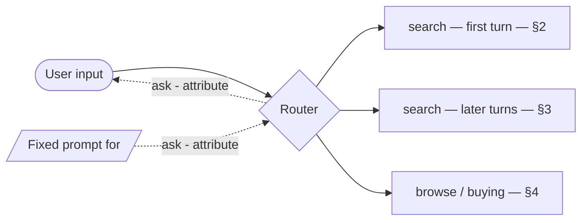
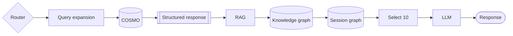
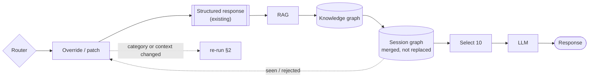
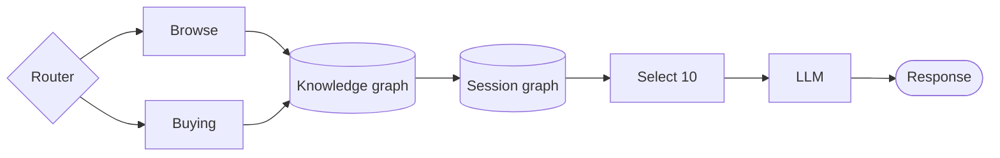
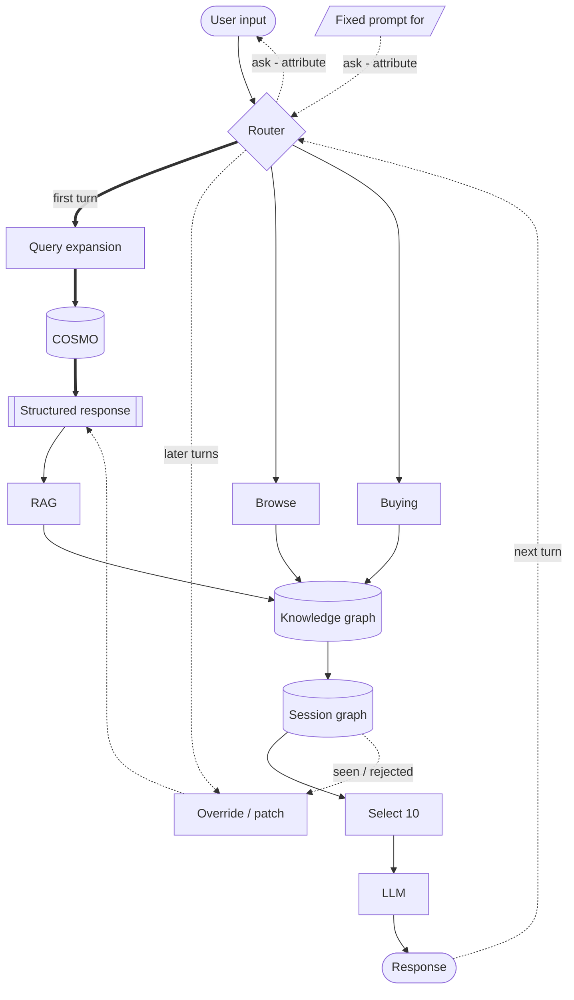

# Shopping Copilot — Architecture

Small diagrams instead of one large one. Sections 2 and 3 are the same branch in two
different modes; section 6 shows everything at once.

## 1. Routing

`Router` classifies intent, and within the search intent it also decides whether this is
the first turn of the session or a follow-up.

## 2. Search branch — first turn

Runs **once per session**.

- `Query expansion` — an LLM widens the raw query into terms and candidate attributes.
- `COSMO` — commonsense enrichment: implicit intent and usage context the user never
  typed. Separate step, separate failure mode, separate cache.
- `Structured response` — the output of the two steps above, frozen as the session's
  query state. Everything downstream reads from here, never from the raw user text.

## 3. Search branch — later turns

No `Query expansion`, no `COSMO`. A small LLM call parses the follow-up into a JSON patch
against the existing `Structured response` — cheaper, and deterministic enough to be
reproducible.

The only path back to §2 is a genuine pivot: `category` changes, or the user introduces a
usage context that was never enriched. Cache `COSMO` output by `(category, context)` so
even that re-run is usually a cache hit.

| | First turn (§2) | Later turns (§3) |
|---|---|---|
| `Query expansion` | yes | no |
| `COSMO` | yes | only on pivot |
| `Structured response` | created | patched |
| LLM calls before retrieval | 1 large | 1 small (patch only) |

## 4. Browse / buying branch

Identical on every turn — no session state to build up front. Both intents hit the same
`Knowledge graph` as the search branch.

## 5. Two graphs, two clocks

`Session graph` and `Knowledge graph` are different objects with different write rules.
Conflating them is the main source of confusion in this design.

| | `Session graph` | `Knowledge graph` / `COSMO` |
|---|---|---|
| Scope | one conversation | global, all users |
| Written | **every user input** | never, at runtime |
| Gate | none — user statements are ground truth here | n/a |
| Lifetime | dies with the session | fixed for the run |

### What each turn adds to the session graph

- Product nodes that were shown, tagged with `turn` and `rank`.
- Attribute nodes tagged with `source`: `catalog`, `cosmo`, or `user`.
- `rejected_by_user` edges — **marked, never deleted**. Delete them and the next
  retrieval returns the same item.
- `preferred_over` edges whenever the user compares two items. This is what makes
  anaphora work: *"the cheaper one"*, *"the second one you showed me"*.
- `shown_at_turn` edges so `Select 10` does not resurface an identical list.

`Select 10` therefore reads from the session graph rather than reranking blind on every
turn: it filters out what was already shown and what was rejected.

The global `Knowledge graph` is read-only at runtime. Nothing a user says during a
conversation writes back to it.

## 6. Everything together

Sections 1–5 in a single view. Bold edges run once per session; dashed edges are
follow-up paths.

Everything here happens inside a single request. There is no offline path.

## 7. Look up the graph, don't rebuild it

Two ways to get from `RAG` to `Knowledge graph`:

- **Lookup / traverse** — `RAG` returns product IDs, which join into the existing graph
  for attributes, relations, substitutes and complements. Tens of milliseconds.
- **Extraction** — run an LLM over retrieved documents to pull entities and relations into
  a fresh subgraph per query (GraphRAG local mode). Several times slower and noisier.

E-commerce catalogs are already structured, so lookup is almost always the right default.
Reserve extraction for unstructured sources — reviews, customer Q&A, long descriptions.
When extraction does run, merge the result into the `Session graph`, never into the global
`Knowledge graph`, and cache it by product ID.

The session graph is what should reach the LLM: small, structured, and traceable — every
sentence in the response maps back to a specific node or edge.

## 8. Out of scope

**Cross-session learning.** An earlier draft had an interaction log, a user profile, and
a critic promoting learned assertions into the global KG on a batch schedule. Cut: it only
pays off at ~50 users and cannot be demonstrated with three. Reinstate only if the system
runs long enough to accumulate real evidence.

Consequence: `Knowledge graph` and `COSMO` are fixed inputs, built before the run and
never modified during it. This is why they are read-only in §5.

## 9. Known gap

`Select 10` has no algorithm specified. It determines output quality more than anything
else in this document, and everything else here is plumbing that feeds it. Decide its
ranking logic before building more of the pipeline.
