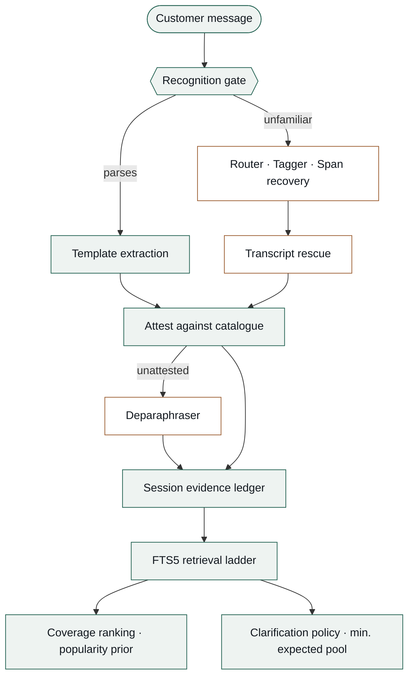

# Grounded Multi-Turn Product Search

Our submission for the TechJam Conversational E-Commerce Search Challenge. It replaces the
starter BM25 agent with a catalogue-grounded conversational retrieval system that maintains
session state, handles intent overrides, asks information-oriented clarification questions,
and ranks exact catalogue `parent_asin` values.

The repository preserves the official participant kit: the public development sessions,
unmodified evaluator, API contract, scoring configuration, final-evaluation FAQ, and
organizer evaluator tests. Our contribution is isolated in [`submission/`](submission/) and
is exposed to the official harness through [`starter/agent.py`](starter/agent.py).

## Results

On the official 200-session public development set, using the unmodified organizer
evaluator, from a clean clone with no `.env` and no API key:

| Hit Rate@10 | MRR | MTTC | TechnicalScore |
|---:|---:|---:|---:|
| 0.9950 | 0.9950 | 2.225 | **0.971500** |

The released BM25 starter records TechnicalScore 0.106710 on the same set.

Self-generated population proxies, 800 sessions each, resampling targets from the released
catalogue under different popularity assumptions. They are generalisation evidence, not
private-label estimates:

| Population | HitRate@10 | MRR | MTTC | TechnicalScore |
|---|---:|---:|---:|---:|
| Organizer-proxy | 0.9938 | 0.9923 | 2.535 | 0.963863 |
| Review-weighted unseen | 0.9850 | 0.9835 | 2.571 | 0.956138 |
| Uniform target | 0.9550 | 0.9500 | 3.214 | 0.918225 |
| Inverse popularity | 0.9300 | 0.9287 | 3.290 | 0.897825 |

Under wording change, 200 sessions per axis. `Offline` is the deterministic path with no
credential; `shipped` adds the two hosted layers:

| Condition | Perturbation | Offline | Shipped |
|---|---|---:|---:|
| Official public set | none | 0.971500 | 0.971500 |
| Template paraphrase | wrapper reworded | 0.930650 | 0.939525 |
| Attribute paraphrase | values reworded | 0.838400 | 0.866000 |
| Both at once | wrapper and values | 0.761937 | 0.788549 |

## Setup and reproduction

Python 3.10 or later. Download the organizer catalogue release and place `catalog.jsonl` at
`data/catalog.jsonl`, as described in [`data/README.md`](data/README.md).

```bash
python -m pip install -r requirements.txt
python -m evaluator.local_evaluator
```

This runs the unmodified official evaluator and writes `results.json`. The evaluator imports
`starter.agent.Agent`, which re-exports the canonical implementation in
`submission.agent.Agent`.

Organizer evaluator tests:

```bash
python -m unittest discover -s tests -v
```

Required public multi-turn demonstration:

```bash
python -m submission.demo --sample-id public_0002
```

It prints each customer message, structured question, recommendation list, token usage, and
the public target's rank, using only the released public session and official simulator.

## Groq configuration

`GROQ_API_KEY` is the only switch that changes anything. Copy [`.env.example`](.env.example)
to `.env` and set it, or export it in the environment. The key is never committed.

```bash
cp .env.example .env
# then edit .env and set GROQ_API_KEY
```

It enables the attribute deparaphraser and the transcript rescue, which recover
catalogue-attested evidence when a customer uses unfamiliar wording. Every proposal they
make is still checked against the frozen catalogue before it can affect retrieval.

**Supplying a key does not change the public-set score, and costs nothing there.** With both
hosted layers enabled, the official 200 sessions still make 0 API calls and spend 0 tokens.
That is control flow rather than a threshold: the recognition gate parses every official
message, so the rescue's parse-failure precondition is zero and the deparaphraser is never
reached. The key matters only for off-template wording, which the public set does not
contain.

Every other variable in `.env.example` is either already the compiled-in default or should
be left unset; the file documents which is which.

## Architecture



Green stages are lexical, amber are learned. Exact mechanisms run first, and the learned
components are reachable only when the exact ones produce nothing. The ordering is enforced
by control flow, not by a confidence threshold.

Both producers of candidate values, template extraction and the unfamiliar-wording path,
converge on a single admission step: attest against the frozen catalogue, else deparaphrase
once at an attenuated tier, else drop. Nothing enters the evidence ledger without passing
through it, which is what makes the recommendation auditable and stops a model adding
unsupported requirements.

The retrieved pool feeds both outputs, so choosing the next question costs no extra
retrieval. That question is the attribute minimising the expected number of candidates
surviving the answer, computed from precomputed catalogue reply signatures.

On the official public set the amber column records 0 loads, 0 inferences and 0 tokens: the
gate leaves nothing unparsed, so it is unreachable by control flow.

## Runtime, model, and cost disclosure

- Python 3.10 or newer. `torch` and `transformers` are the only dependencies beyond the
  standard library, required solely by the optional local models. The core retrieval path
  uses the standard library and in-memory SQLite FTS5.
- Measured latency, median of three runs on an idle machine: 10.3 s agent index build and
  0.6 s evaluator catalogue index, both one-off, then 15.0 s for the 200 scored sessions, at
  75 ms per session. End to end 25.7 s. Supplying a key does not change this, 15.1 s and
  25.8 s, because no call is made.
- Tokens and cost on the public set: 0 prompt, 0 completion, USD 0.00, with or without a
  credential. Across both wording-perturbation axes, 400 sessions, measured spend was under
  9,000 tokens, below one US cent at current rates.
- Local models: guarded DistilBERT route and token-tagging checkpoints,
  `KhiemGOM/techjam-route-classifier` and `KhiemGOM/techjam-scaffolding-tagger`, lazily
  loaded only for unfamiliar wording. If unavailable the agent uses its deterministic
  lexical fallback.

  The weights are **not in this repository**. They are fetched from the Hugging Face Hub on
  first use, which is the only network dependency of the offline configuration and is never
  reached on the public set. To pre-fetch them, or to run with no network at all:

  ```bash
  python -c "from huggingface_hub import snapshot_download as d; [d(r) for r in ('KhiemGOM/techjam-route-classifier', 'KhiemGOM/techjam-scaffolding-tagger')]"
  ```

  Nothing needs configuring afterwards: resolution prefers a local checkpoint that actually
  contains weights, and otherwise uses the Hub.
- Hosted model: optional Groq `openai/gpt-oss-20b` for the deparaphraser and transcript
  rescue. Requires `GROQ_API_KEY`, is never called without one, and uses the account and
  pricing chosen by the team running evaluation.
- Hardware: Windows laptop with a 13th Gen Intel Core i9-13900HX (24 cores, 32 logical
  processors) and 32 GB RAM. The public-score path does not invoke the optional local
  checkpoints and does not require a GPU. An RTX 4060 was used for local-model training and
  robustness experiments, retained on the `full` branch.

## Reproducibility

The submitted commit was cloned fresh with no environment file, no response caches and no
local model weights, and the organizer's evaluator run against it: 0.971500, HitRate@10
0.9950, MRR 0.9950, MTTC 2.225, zero tokens. Both learned checkpoints downloaded from the
Hub into an empty cache and ran inference on an unparsed message.

The hosted layers cache their responses, so the perturbation axes were run twice, once with
warm caches and once from that cold clone where every call was paid for:

| Condition | Warm cache | Cold clone | Difference |
|---|---:|---:|---:|
| Template paraphrase | 0.939525 | 0.939525 | **+0.000000** |
| Attribute paraphrase | 0.866000 | 0.866000 | **+0.000000** |

Caching affects cost, not outcome.

## Repository layout

| Path | Purpose |
|---|---|
| [`starter/agent.py`](starter/agent.py) | Official evaluator entry point, re-exporting our Agent |
| [`submission/`](submission/) | Our agent, guarded fallback modules, dictionary, setup details |
| [`evaluator/`](evaluator/) | Unmodified organizer local evaluator |
| [`data/public_set.jsonl`](data/public_set.jsonl) | Organizer public development sessions |
| [`docs/`](docs/) | Organizer contract, rules, score configuration, and final-evaluation FAQ |
| [`tests/`](tests/) | Organizer evaluator tests |

The exhaustive research record, internal robustness suites, experiment logs, and web
demonstration are retained on the
[`full` branch](https://github.com/DanielNg0729/L-GPT/tree/full). They are intentionally
excluded from this final-evaluation branch.

## Limitations

- **Simulator-shaped.** Every constraint the simulator speaks is a verbatim substring of the
  target document, which is a property of the organizer's generative process rather than of
  shopping. Against human phrasing the exact layers degrade, and the robustness evidence
  above is self-generated synthetic variation.
- **Popularity-leaning.** The benchmark rewards popular targets and so does the ranking
  prior. The inverse-popularity fold bounds what that costs.
- **Hosted calls are not bit-reproducible** even at temperature zero, which is why every
  headline figure comes from the offline path.
- **Disclosure optimises the metric, not the experience.** One candidate per turn and ten on
  the last maximises MRR under the official formula; a real shopper would prefer a shortlist
  throughout.

Three attributes, `category`, `brand` and `budget`, are never asked because no evaluator
branch can pay them out, measured at 0 payouts in 200 sessions. That is a property of the
simulator, not of the method: the clarification policy ranks whatever askable set it is
given, so a live shopper who can answer about budget and brand simply widens the set.

## Team contributions

| Member | Responsibility | Contribution |
|---|---|---|
| **Khiem** | Lead engineer, experimentation | Shipped agent end to end: recognition gate, template extraction, span recovery, grounded mining, FTS5 retrieval ladder, coverage ranking, session ledger, disclosure policy. Experiment programme, robustness and population-shift suites, release tests. |
| **Duong** | Hosted model layer | Attribute deparaphraser (generate-then-verify), transcript rescue, and the gating that keeps hosted calls off the scored path. |
| **Thanh Duy** | Architecture, reproducibility audit | Final escalation-ladder design, component boundaries and integration review. Owned reproducibility: verifying that a clean clone reproduces the reported figures, that the organizer-owned files remain unmodified, and that every documented command does what it claims. Built an alternative pipeline, measured and rejected. |
| **Huy** | Data analysis, industry research | Exploratory analysis of the catalogue and released sessions, and the production conversational-commerce practice the design draws on: clarification budgeting, dialogue state with override reset, popularity priors, lexical-first retrieval. Built an alternative pipeline, measured and rejected. |
| **Tai** | Rules compliance, evaluation, deliverables | Read the specification, submission rules and evaluation FAQ against the implementation, checking the shipped configuration violates none of them. Participant-kit setup and checksum verification, exact reproduction of the published baseline (0.10671), and the data profile whose probe expected-value and target-popularity analyses informed the ask policy and ranking prior. Non-code deliverables including the demo and report. Built an additional hosted node, measured and rejected. |

Rejected alternatives are listed rather than omitted. The shipped design is only defensible
against the ones that lost.

Catalogue and sessions derive from Amazon Reviews 2023 (McAuley Lab, UCSD); see
[`DATA_ATTRIBUTION.md`](DATA_ATTRIBUTION.md).
