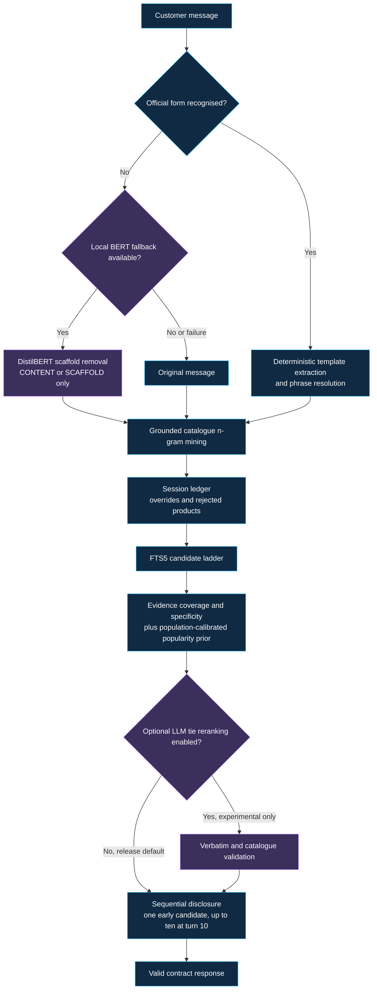

# Grounded Multi-Turn Product Search

A submission-ready conversational retrieval agent for the TechJam multi-turn e-commerce
search challenge. The system searches a frozen 50,000-product Amazon Clothing catalogue,
asks targeted clarification questions, maintains active constraints and rejection history,
handles intent changes, and returns ranked `parent_asin` values through the official Python
interface.

The shipped path is offline, deterministic, and costs $0.00 per evaluation.

## Verified results

| Evaluation | Sessions | HitRate@10 | MRR | MTTC | TechnicalScore |
|---|---:|---:|---:|---:|---:|
| Official public development set | 200 | 0.9950 | 0.9950 | 2.3200 | **0.969600** |
| Tune800 fixed selection fold | 800 | 0.9775 | 0.976875 | 2.94875 | **0.942837** |
| Unseen4x800 independent mean | 4 x 800 | 0.983438 | 0.981563 | 2.81469 | **0.949894** |
| Published weak BM25 baseline | 200 | 0.1250 | 0.068034 | 9.8100 | 0.106710 |

Trial 38 was frozen before the four independent folds were evaluated. It preserved the
public score and improved the untouched-fold mean by `+0.001213` over the previous shipped
configuration. The gain is small and is reported as a candidate-selection signal, not as a
private-score claim. See the [independent validation report](docs/validation/independent_validation.md).

## Final shipped pipeline

The simulator reveals constraints derived from the target product's catalogue record. The
agent therefore treats the task as grounded provenance recovery rather than general semantic
search. The following is the complete execution path of `submission/agent.py`.

```text
customer message
    -> exact official-form recognition
    -> deterministic template extraction and phrase resolution
    -> gated BERT scaffolding fallback for unfamiliar wording only
    -> catalogue-attested n-gram mining
    -> session ledger, override handling, and rejection management
    -> FTS5 candidate ladder
    -> evidence coverage plus population-calibrated ranking
    -> optional exact-tie LLM reranking, disabled by default
    -> sequential disclosure and contract-shaped response
```



1. **Catalog initialization.** `CatalogIndex` builds an in-memory SQLite FTS5 index over
   the frozen participant-visible fields and caches normalized product text, document
   frequencies, title spans, and `log1p(rating_number)`.
2. **Session initialization.** `reset()` stores only the safe aggregate preference tags and
   starts a fresh ledger for evidence, asked attributes, rejected recommendations, turn
   count, and override state.
3. **Official-form recognition.** Anchored patterns recognize the message shapes emitted by
   the released simulator. Recognized messages use deterministic category and constraint
   extraction. No BERT model or API request is reachable on this route.
4. **Grounded evidence extraction.** Extracted clauses are resolved to the longest phrases
   attested in the frozen catalogue. The agent never accepts a model-generated requirement
   that is absent from the visible customer message or catalogue.
5. **Gated BERT fallback.** Only when a message is not recognized, the lazily loaded local
   DistilBERT tagger may remove conversational scaffolding before mining. It labels words as
   `CONTENT` or `SCAFFOLD`; it does not retrieve products, rank products, invent
   requirements, or call a network. Missing dependencies, weights, invalid output, or any
   inference failure return the original message to the deterministic miner. This is the
   BERT fallback, not a dependency of the official-form path.
6. **Catalogue-grounded n-gram mining.** If templates do not provide a constraint, bounded
   n-grams are enumerated from the message or BERT-stripped text. Only phrases with positive
   catalogue document frequency at or below the fixed cap are retained.
7. **Optional external extraction.** On unrecognized wording only, Groq extraction can add
   candidate spans if `LLM_EXTRACT=1` and a key are both supplied. It is disabled in the
   release. Every span still passes verbatim and catalogue-attestation checks.
8. **Dialogue state and overrides.** Evidence accumulates across turns. An override clears
   incompatible rejection evidence so a candidate shown before the new intent is never
   incorrectly penalized.
9. **Clarification policy.** The agent asks from a measured order of useful attributes while
   returning recommendations in the same response. Attributes that the simulator never
   meaningfully pays out are excluded.
10. **FTS5 candidate ladder.** The retrieval layer attempts selective conjunctive phrase
    queries, progressively shorter conjunctive backoffs, a disjunctive phrase query, and a
    bag-of-words floor. It always has a deterministic fallback.
11. **Ranking and population calibration.** Candidates are ranked by weighted phrase
    coverage, phrase specificity, evidence source, and a popularity prior. The only
    population-sensitive coefficient is scaled from aggregate retrieved-pool popularity,
    never from target labels or product identity.
12. **Tie handling and rejection demotion.** Optional Groq tie reranking is disabled because
    it lost to popularity in measurement. Candidates shown on a prior non-terminal turn are
    demoted, not removed, preserving the final recall budget.
13. **Sequential disclosure.** The agent returns its highest-confidence candidate on turns
    1 through 9 and up to ten candidates at turn 10. This preserves final-turn recall while
    placing successful early hits at rank 1.
14. **Contract and failure boundary.** `respond()` returns a string, allowed structured
    attribute, ordered catalogue identifiers, and non-negative per-turn token usage. Any
    internal failure returns the last valid ranking instead of raising.

The official release is offline, deterministic, and reports zero API tokens. The BERT
fallback is a real local, gated component retained for unfamiliar wording; it is not needed
to achieve the reported official score. Optional Groq extraction and reranking are disabled
by default.

## Repository guide

| Path | Purpose |
|---|---|
| [`submission/`](submission/) | Canonical agent, optional model integrations, and packaging documentation |
| [`starter/`](starter/) | Evaluator entry point, kept identical to the canonical agent |
| [`evaluator/`](evaluator/) | Official local simulator and scorer |
| [`robustness/`](robustness/) | Reproducible private-like proxy and population-shift suites |
| [`experiments/`](experiments/) | Experiment registry, runnable scripts, raw results, and complete findings |
| [`docs/`](docs/) | Competition evidence, design rationale, research, and validation reports |
| [`tests/`](tests/) | Contract, determinism, fallback, model-gate, and robustness tests |
| [`data/`](data/) | Released sessions, checksums, and catalogue download instructions |

Start with the [experiment registry](experiments/EXPERIMENT_INDEX.md) for a compact
navigator. The [experiment decision log](experiments/EXPERIMENT_DECISION_LOG.md) records
every versioned investigation, its result, acceptance or rejection, and its effect on the
final design. The [complete findings ledger](experiments/EXPERIMENT_FINDINGS.md) retains
methods, measurements, corrections, and negative results.

## Technology and data

- Python 3.10 or newer
- SQLite FTS5 for in-process lexical retrieval
- PyTorch and Hugging Face Transformers for the optional local DistilBERT tagger
- Groq's OpenAI-compatible API for optional extraction and rejected reranking experiments
- Amazon Reviews 2023 `Clothing_Shoes_and_Jewelry` metadata and organizer-released sessions

All official scoring runs use the frozen organizer catalogue and released evaluator. No
private labels, raw user histories, free-text reviews, or organizer-only files are included.

## Installation

Python 3.10 or newer is required.

```bash
python -m pip install -r submission/requirements.txt
```

If `data/catalog.jsonl` is absent, download and decompress the frozen release catalogue:

```bash
curl -L -o data/catalog.jsonl.gz https://github.com/TechJam2026/techjam-conversational-search/releases/download/participant-kit/catalog.jsonl.gz
gzip -dk data/catalog.jsonl.gz
```

Verify the download against `data/SHA256SUMS`. The catalogue is not duplicated in Git.

## Reproduce the evaluation

Run the official public evaluator:

```bash
python -m evaluator.local_evaluator
```

Run the custom four-condition population stress suite:

```bash
python -m robustness.build_sets
python -m robustness.run_benchmark
```

Run only its organizer-aligned anchor condition:

```bash
python -m robustness.run_benchmark --only organizer_proxy_800
```

## Evaluation and robustness tests

The following memorable labels are used throughout the documentation. They describe fixed,
versioned data sets; the historical filenames are retained for reproducibility.

| Name | Current contents | Purpose | Interpretation |
|---|---|---|---|
| **Official200** | 200 organizer-released public sessions | Official local score | The only published-score reproduction. |
| **Tune800** | One fixed, stratified organizer-statistics proxy fold | Parameter search | Used by Optuna only. It is not independent validation. |
| **Unseen800** | One independent 800-session draw from the same proxy population | Ordinary sample-variance check | A single fold is diagnostic only. |
| **Unseen4x800** | Four frozen, independently seeded `Unseen800` folds | Independent same-population validation | The candidate-selection check used to choose trial 38. |
| **Shifted4x800** | Four 800-session conditions: organizer proxy, broad review-weighted, uniform, and inverse-popularity | Fast population-assumption stress test | The last three are deliberately non-private-like stress conditions. |
| **Shifted12x800** | Twelve controlled shifts: 5%, 10%, and 20% total-variation movement toward less or more popular products, each with two replicates | Final population-generalization characterization | Measures sensitivity to a changed popularity distribution, not expected private score. |
| **ParaphraseT1-T5** | Historical controlled wording disturbances | Organizer-choice stress characterization | Not an official-score proxy because paraphrasing is not stated in the written rules. |
| **Contract25** | 25 automated unit, contract, determinism, dataset-invariant, optional-API, and model-gate checks | Release safety | Validates behavior and failure handling, not ranking quality. |

`Unseen800` is the unit of same-population validation. `Unseen4x800` is the complete
four-fold validation suite. `Shifted4x800` is the rapid four-condition stress suite. The
more rigorous final disturbance suite contains twelve folds, so it is called
`Shifted12x800` rather than `Shifted4x800`.

### How to use the custom robustness suites

Prerequisite: download the released frozen catalogue as described above. All suites use the
official simulator and disable optional network models by default.

```bash
# Build and score the rapid Shifted4x800 suite.
python -m robustness.build_sets
python -m robustness.run_benchmark

# Rebuild the fixed Tune800 and Unseen4x800 data sets from their recorded seeds.
python -m robustness.build_optuna_v2_sets

# Rebuild the controlled Shifted12x800 data sets from their recorded seeds.
python -m robustness.build_independent_validation_sets

# Score the frozen candidate registry on Unseen4x800 plus Shifted12x800.
python experiments/scripts/57_independent_validation.py
```

Do not use `Tune800`, `Unseen4x800`, or `Shifted12x800` for additional parameter tuning.
Their recorded evaluations are already consumed validation evidence. For a new candidate,
create a new seeded suite and keep it separate from final reporting. Detailed construction,
invariants, and historical outputs are in [robustness/README.md](robustness/README.md) and
[the independent-validation report](docs/validation/independent_validation.md).

Run all automated tests:

```bash
python -m unittest discover -s tests -v
```

Run the demonstrated intent-override session:

```bash
python -m submission.demo --sample-id public_0002
```

The corresponding annotated transcript is in [`docs/DEMO.md`](docs/DEMO.md).

The evaluator imports `starter.agent`. `starter/agent.py` and `submission/agent.py` must
remain byte-identical for a release.

## Model, network, and cost disclosure

- Required external API: none.
- Default external-model cost: $0.00.
- Measured public evaluation latency: 17.93 seconds for 200 sessions in the final local
  audit environment, including one-time index construction.
- Reported public token usage: 0 prompt tokens and 0 completion tokens.
- Local model: fine-tuned `distilbert-base-uncased`, stored through Git LFS.
- Optional API: Groq extraction or reranking requires both `GROQ_API_KEY` and an explicit
  feature flag.
- Safety boundary: optional model output must be a verbatim span from the visible message
  and must be attested in the frozen catalogue.
- Fallback: missing dependencies, weights, credentials, network, or valid model output
  returns control to the lexical pipeline.

Never commit credentials. Use environment variables or an ignored local `.env` file.

## Scope and limitations

The exact organizer-private target identities are unavailable. Internal proxies reproduce
the disclosed 1,406-target universe, 800 distinct private targets, public-target
disjointness, scenario proportions, and observed popularity distribution without claiming
to reconstruct private labels.

The agent benefits from the literal relationship between disclosed constraints and target
catalogue text. The repository also retains paraphrase and population-shift tests as
robustness characterization. Project Q&A notes report that paraphrasing is absent from the
official evaluation, but that point is not reproduced in the written specification and is
not used as an official-score claim.

Given more time, the highest-value improvements would be reducing the optional tagger's
package size, validating on an organizer-provided eligibility pool, and replacing
template-family stress tests with independently authored language variations. Additional
public-only tuning would not be justified because the measured gains are already smaller
than fold variance.

Catalogue and sessions derive from Amazon Reviews 2023 by McAuley Lab, UCSD. See
[`DATA_ATTRIBUTION.md`](DATA_ATTRIBUTION.md).
