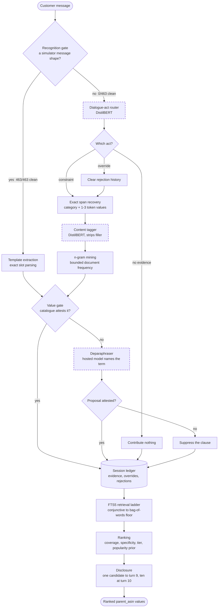

# Grounded Multi-Turn Product Search

A submission-ready conversational retrieval agent for the TechJam multi-turn e-commerce
search challenge. The system searches a frozen 50,000-product Amazon Clothing catalogue,
asks targeted clarification questions, maintains active constraints and rejection history,
handles intent changes, and returns ranked `parent_asin` values through the official Python
interface.

The shipped path is offline, deterministic, and costs $0.00 per evaluation.

> **Where the rest of the work is.** This branch carries the submission: the agent, the
> organizer's unmodified kit, the tests, and the report. The measurement record that
> justifies the design -- roughly 500 further files of experiments, datasets, results and
> notes -- lives on the [`experimental`](https://github.com/DanielNg0729/L-GPT/tree/experimental)
> branch, which is where every `experiments/` link below points.

## Run it

Python 3.10 or newer. The scored path uses only the standard library.

```bash
python -m pip install -r requirements.txt
```

The catalogue is not committed (60 MB). If `data/catalog.jsonl` is absent:

```bash
curl -L -o data/catalog.jsonl.gz https://github.com/TechJam2026/techjam-conversational-search/releases/download/participant-kit/catalog.jsonl.gz
gzip -dk data/catalog.jsonl.gz
```

Verify the download against `data/SHA256SUMS`.

**Reproduce the headline score** — the organizer's own evaluator, unmodified:

```bash
python -m evaluator.local_evaluator
```

Expect `recommended_technical_score = 0.971500`, with **0 prompt and 0 completion tokens**.
No network access is required and no API key is used.

The two learned checkpoints are **not** in the repository — they live on the Hugging Face
Hub and are fetched on first use, only when a message fails the recognition gate. Nothing on
the scored path needs them, so a clone with no network still reproduces the headline score.
To pre-fetch them, or to point at a local copy:

```bash
python -c "from huggingface_hub import snapshot_download as d; [d(r) for r in ('KhiemGOM/techjam-route-classifier','KhiemGOM/techjam-scaffolding-tagger')]"
```

```bash
V2_ROUTE_MODEL_DIR=/path/to/route_classifier BERT_TAGGER_DIR=/path/to/scaffolding_tagger python -m evaluator.local_evaluator
```

**Check that we did not touch what we were not allowed to touch:**

```bash
python tools/verify_upstream_integrity.py
```

**Run the release safety suite** — contract, determinism, failure handling, model gating:

```bash
python -m unittest discover -s tests
```

**Score the population-shift suites** (four 800-session draws, ~6 minutes):

```bash
python experiments/studies/build_sets.py        # regenerate the suites (optional; they are committed)
python tools/run_population_benchmark.py
python tools/run_population_benchmark.py --only organizer_proxy_800   # just the anchor condition
```

| what you ran | expected |
|---|---|
| `evaluator.local_evaluator` | 0.971500 · HR@10 0.9950 · MRR 0.9950 · MTTC 2.225 |
| `verify_upstream_integrity.py` | all 6 organizer-owned files unmodified |
| `unittest discover -s tests` | 29 tests, OK |
| `run_population_benchmark.py` | 0.954163 / 0.947263 / 0.885581 / 0.867775 |

Everything above is offline and deterministic. The optional hosted layer needs
`GROQ_API_KEY`; without one it is inert and the agent is byte-identical to a lexical-only
run. Set `LLM_RESOLVE=0` to disable it outright.


## What this task actually is

The released simulator builds every customer utterance from the target product's own
catalogue record: `intent_card()` reads `features` and `details`, regexes material and
colour out of the product's searchable text, and formats price. Every constraint the
customer speaks is therefore a **verbatim substring of the target document**.

That makes the benchmark a *string-provenance recovery* problem rather than a semantic
search problem, and it is worth saying plainly rather than dressing up: exact phrase
matching against the catalogue is not a trick here, it is the tool that fits the generative
process. A dense retriever is solving a harder problem than the one being scored.

We took the hackathon's intent to be the harder problem, so the system is built as a
**hybrid**: cheap exact mechanisms run first because they are correct and free when they
apply, and learned components take over when the cheap ones cannot see the answer. To find
out whether that actually generalises, we generated our own paraphrase corpora and measured
against them, rather than assuming that passing a ten-turn templated harness implies
handling natural language.

## Verified results

Scored through the organizer's own `evaluator/local_evaluator.py`, unmodified.

| Evaluation | Sessions | HitRate@10 | MRR | MTTC | TechnicalScore |
|---|---:|---:|---:|---:|---:|
| Official public development set | 200 | 0.9950 | 0.9950 | 2.225 | **0.971500** |
| Organizer-proxy population | 800 | 0.9860 | 0.9840 | 2.701 | **0.954163** |
| Review-weighted unseen population | 800 | 0.9790 | 0.9760 | 2.746 | **0.947263** |
| Uniform-target population | 800 | 0.9240 | 0.9170 | 3.572 | **0.885581** |
| Inverse-popularity population | 800 | 0.9010 | 0.8990 | 3.630 | **0.867775** |
| Published weak BM25 baseline | 200 | 0.1250 | 0.0680 | 9.8100 | 0.106710 |

Robustness under wording change, on suites we generated ourselves. These are
characterisation, not leaderboard claims — the organizer confirmed the released simulator
does not paraphrase.

| Perturbation | Deterministic only | Shipped hybrid | Recovered |
|---|---:|---:|---:|
| Template paraphrase (wrapper reworded) | 0.666810 | **0.919540** | +0.252730 |
| Attribute paraphrase (values reworded) | 0.847103 | 0.847103 / **0.863969** with resolver | +0.016866 |
| Both at once | 0.604585 | **0.810251** | +0.205666 |

Every optional **learned** layer is measured at **+0.000000** on all five decision criteria,
and that is the no-regression rule holding rather than an absence of effect: audited
directly, the two DistilBERTs record **0 model loads and 0 inferences** across all 2,716
messages of the public set and the unseen population, because 0 of those messages fail the
recognition gate. The hosted deparaphraser is the one layer the message gate does not
govern -- it is consulted per *value* -- and it is reachable **0 times on the public set and
2 times in 800 unseen sessions**, where the values in question are a mid-word truncation
from `intent_card()` and a malformed price.

## Architecture

The agent escalates through mechanisms ordered by cost and certainty. Each layer runs only
where the cheaper one below it could not produce an answer, so the expensive machinery
never touches traffic the simple machinery already handles correctly.

```text
                        cost and certainty increase downward
  ---------------------------------------------------------------------------
  MESSAGE LEVEL   is this one of the simulator's own message shapes?
    recognised    -> exact slot parsing
    unfamiliar    -> dialogue-act router, span recovery, content tagger, mining
  ---------------------------------------------------------------------------
  VALUE LEVEL     does the frozen catalogue attest this phrase?
    attested      -> admit as evidence
    unattested    -> hosted deparaphraser proposes; catalogue admits or drops
  ---------------------------------------------------------------------------
  SESSION LEVEL   ledger -> retrieval ladder -> ranking -> disclosure
```

The two levels are independent, and that is the point: **a message can be perfectly
recognised and still carry a value the catalogue has never seen.** Wording changes on those
two axes are different failures and are handled by different mechanisms.



**Dashed boxes are the learned components, and they are unreachable on scored traffic.**
Not unlikely — unreachable, by control flow. Audited across the public set and the unseen
population: 2,716 messages, **0 unrecognised**, so the two DistilBERTs record **0 model
loads and 0 inferences**. The deparaphraser sits behind the *value* gate rather than the
message gate, and is consulted **0 times on the public set and twice in 800 unseen
sessions** — a mid-word truncation from `intent_card()` and a malformed price.

**Why the recognition gate matters.** It answers a question no confidence score can: *is
this the simulator's own wording, or has something reworded it?* Measured over a clean run,
463 of 463 messages are recognised and 0 of 3,929 perturbed ones are. That perfect
separation is what makes the learned layers safe to enable — they are unreachable on clean
traffic as a property of control flow, so the deterministic score cannot move.

**Two independent ways wording can change**, handled by different mechanisms because they
break different things:

- **Template paraphrase** reworks the wrapper and leaves values intact. Node 1 recovers the
  dialogue act; exact span recovery finds the values, which are still catalogue vocabulary.
- **Attribute paraphrase** reworks the values and leaves wrappers intact. Exact lookup
  cannot help — the value has left the vocabulary — so the deparaphraser names the
  catalogue term and a `df > 0` check decides whether it may become evidence.

**The model proposes; the catalogue disposes.** No layer can introduce a phrase the frozen
catalogue does not contain. That is what keeps a hosted model from inventing requirements.

## Learned components

| Component | Where it runs | Cost on the scored path |
|---|---|---|
| Node 1 dialogue-act router (DistilBERT, 257 MB) | unfamiliar wording only | 0 model loads, 0 inferences |
| Content tagger (DistilBERT, 254 MB) | unfamiliar wording only | 0 model loads, 0 inferences |
| Attribute deparaphraser (hosted, `openai/gpt-oss-20b`) | catalogue-unattested values only | 0 requests, 0 tokens |

All three ship **enabled**. The deparaphraser additionally requires `GROQ_API_KEY`; without
one it is inert — no client, no request, byte-identical to a lexical run — which is what an
evaluator without our key sees. Set `LLM_RESOLVE=0` to disable it outright, appropriate if
the environment forbids network egress, if exact reproducibility is required (the provider
is not bit-reproducible even at temperature 0), or if there is any doubt about per-call
cost. **The deterministic pipeline is the product; these are additions to it, never
dependencies of it.**

Two further layers ship **disabled** and are documented rather than removed: hosted span
extraction, superseded by the local tagger which beat it on the hardest transform, and
hosted tie reranking, which lost to the popularity prior in measurement.

## Repository guide

### Start here

**The agent is [`submission/agent.py`](submission/agent.py).** Everything else is either the
organizer's kit, a component that file calls, or evidence for why it is built the way it is.

The shipped system is **28 files**. Everything else lives under [`experiments/`](https://github.com/DanielNg0729/L-GPT/tree/experimental/experiments)
— the measurement record, not the product. That ratio is deliberate: almost every design
decision here was chosen against a measurement, and the negative results are kept because
they are the reason the positive ones can be trusted. Start at
[`experiments/INDEX.md`](https://github.com/DanielNg0729/L-GPT/blob/experimental/experiments/INDEX.md).

| Pipeline stage | Source | Runs when |
|---|---|---|
| Recognition gate, template extraction, retrieval, ranking, clarification | [`submission/agent.py`](submission/agent.py) | always |
| Exact catalogue span and category recovery | [`submission/span_node.py`](submission/span_node.py) | wrapper unrecognised |
| Dialogue-act router (DistilBERT) | [`submission/route_node.py`](submission/route_node.py) | wrapper unrecognised |
| Scaffolding tagger (DistilBERT) | [`submission/bert_extract.py`](submission/bert_extract.py) | wrapper unrecognised |
| Attribute deparaphraser (hosted) | [`submission/llm_resolve.py`](submission/llm_resolve.py) | value unattested by the catalogue |
| Shared Groq client — **plus an unadopted reranker** | [`submission/llm_rerank.py`](submission/llm_rerank.py) | client always; reranker never (opt-in, off) |
| Unadopted LLM span extractor | [`submission/llm_extract.py`](submission/llm_extract.py) | never (opt-in, off) |

The last two are retained as measured, rejected experiments rather than deleted. Note that
`llm_rerank.py` is misleadingly named: it holds the HTTP plumbing the shipped deparaphraser
imports, so removing it would break a layer that *is* enabled.

### Integrity of the organizer's files

The rules forbid modifying the evaluator, the public set, and the released contracts. That
claim is checkable rather than asserted:

```bash
python tools/verify_upstream_integrity.py
```

It hashes all six protected files against [`UPSTREAM_INTEGRITY.sha256`](UPSTREAM_INTEGRITY.sha256)
and is enforced by `tests/test_upstream_integrity.py`.

### Layout

| Path | Purpose |
|---|---|
| [`submission/`](submission/) | Canonical agent, optional model integrations, and packaging documentation |
| [`starter/`](starter/) | Evaluator entry point; re-exports the canonical agent so there is exactly one implementation |
| [`evaluator/`](evaluator/) | Official local simulator and scorer |
| [`docs/research/`](https://github.com/DanielNg0729/L-GPT/tree/experimental/docs/research) | Pre-agent research: catalogue/session data profile, industry-practice notes |
| [`experiments/profile/`](https://github.com/DanielNg0729/L-GPT/tree/experimental/experiments/profile) | The profiling scripts behind the data profile (field coverage, probe expected value, target priors) |
| [`experiments/log/`](https://github.com/DanielNg0729/L-GPT/tree/experimental/experiments/log) | Numbered chronological experiments, in the order they were run |
| [`experiments/studies/`](https://github.com/DanielNg0729/L-GPT/tree/experimental/experiments/studies) | Reusable study scripts: `audit_` / `build_` / `evaluate_` / `train_` / `run_` |
| [`experiments/datasets/`](https://github.com/DanielNg0729/L-GPT/tree/experimental/experiments/datasets) | Every generated suite — see [DATASETS.md](https://github.com/DanielNg0729/L-GPT/blob/experimental/experiments/DATASETS.md) for what each one is and how it was made |
| [`experiments/results/`](https://github.com/DanielNg0729/L-GPT/tree/experimental/experiments/results) | Raw measurement output, one file per run |
| [`experiments/notes/`](https://github.com/DanielNg0729/L-GPT/tree/experimental/experiments/notes) | Literature review, validation write-ups, decision briefs |
| [`docs/`](docs/) | Competition evidence, design rationale, research, and validation reports |
| [`tests/`](tests/) | Contract, determinism, fallback, model-gate, and robustness tests |
| [`data/`](data/) | Released sessions, checksums, and catalogue download instructions |
| [`tools/`](tools/) | Runtime benchmark and the upstream-integrity verifier |

**Two requirements files, and which one you need.**
[`requirements.txt`](requirements.txt) is the submission: it pulls in
`submission/requirements.txt` and is all the scored path needs.
[`requirements-models.txt`](requirements-models.txt) pins Torch and Transformers
for the *optional* learned components and the experiments that trained them. The scored
deterministic path never imports it.

Start with the [experiment registry](https://github.com/DanielNg0729/L-GPT/blob/experimental/experiments/INDEX.md) for a compact
navigator. The [experiment decision log](https://github.com/DanielNg0729/L-GPT/blob/experimental/experiments/DECISION_LOG.md) records
every versioned investigation, its result, acceptance or rejection, and its effect on the
final design. The [complete findings ledger](https://github.com/DanielNg0729/L-GPT/blob/experimental/experiments/FINDINGS.md) retains
methods, measurements, corrections, and negative results.

## Technology and data

**Runtime**

- Python 3.10 or newer; the scored deterministic path uses only the standard library
- SQLite FTS5 for in-process lexical retrieval, no external search service
- PyTorch and Hugging Face Transformers, lazily imported, for the two local DistilBERT
  components (dialogue-act router, content tagger)
- Groq's OpenAI-compatible API (`openai/gpt-oss-20b`) for attribute deparaphrasing, via
  `urllib` — no vendor SDK is a dependency

**Research and evaluation only, not runtime dependencies**

- sentence-transformers encoders (`all-mpnet-base-v2`, `e5-base-v2`, `all-MiniLM-L6-v2`,
  `bge-small-en-v1.5`, `Qwen3-Embedding-0.6B`) — evaluated as retrievers and verifiers,
  all rejected, kept in the log with their numbers
- `cross-encoder/nli-deberta-v3-small` for the entailment verifier experiment, rejected
- Optuna for the joint hyperparameter search that produced the frozen trial-38 constants
- Claude Haiku, used once to generate the open-vocabulary paraphrase corpus — deliberately
  a different model family from the solver, so the suite is not the solver inverting its
  own encoding

**Data and assets**

- Amazon Reviews 2023 `Clothing_Shoes_and_Jewelry` metadata (the organizer's frozen 50k
  catalogue) and the organizer-released public sessions
- A 7,922-entry attribute vocabulary mined from that catalogue's `features` and `details`
- Synthetic evaluation corpora we generated: held-out message-template banks, four
  population-shift suites, and a 204-phrase open-vocabulary paraphrase set over targets
  disjoint from the public sessions

**Development tools.** VS Code, Claude Code for pair development, Git, and a local CUDA
workstation for the training and evaluation runs.

All official scoring runs use the frozen organizer catalogue and released evaluator. No
private labels, raw user histories, free-text reviews, or organizer-only files are
included, and `evaluator/` and `data/public_set.jsonl` are byte-identical to the
organizer's release.

## Evaluation and robustness tests

The following memorable labels are used throughout the documentation. They describe fixed,
versioned data sets; the historical filenames are retained for reproducibility.

| Name | Current contents | Purpose | Interpretation |
|---|---|---|---|
| **Official200** | 200 organizer-released public sessions | Official local score | The only published-score reproduction. |
| **Tune800** | One fixed, stratified organizer-statistics proxy fold | Parameter search | Used by Optuna only. It is not independent validation. |
| **Unseen800** | One independent 800-session draw from the same proxy population | Ordinary sample-variance check | A single fold is diagnostic only. |
| **Unseen4x800** | Four frozen, independently seeded `Unseen800` folds | Independent same-population validation | The candidate-selection check used to choose trial 38. |
| **Shifted4x800** | Four 800-session conditions: organizer proxy, broad review-weighted, uniform, and inverse-popularity | Fast population-assumption stress test | The last three are deliberately non-private-like stress conditions. |
| **Shifted12x800** | Twelve controlled shifts: 5%, 10%, and 20% total-variation movement toward less or more popular products, each with two replicates | Final population-generalization characterization | Measures sensitivity to a changed popularity distribution, not expected private score. |
| **ParaphraseT1-T5** | Historical controlled wording disturbances | Organizer-choice stress characterization | Not an official-score proxy because paraphrasing is not stated in the written rules. |
| **Contract25** | 25 automated unit, contract, determinism, dataset-invariant, optional-API, and model-gate checks | Release safety | Validates behavior and failure handling, not ranking quality. |

`Unseen800` is the unit of same-population validation. `Unseen4x800` is the complete
four-fold validation suite. `Shifted4x800` is the rapid four-condition stress suite. The
more rigorous final disturbance suite contains twelve folds, so it is called
`Shifted12x800` rather than `Shifted4x800`.

### How to use the custom robustness suites

Prerequisite: download the released frozen catalogue as described above. All suites use the
official simulator and disable optional network models by default.

```bash
# Build and score the rapid Shifted4x800 suite.
python experiments/studies/build_sets.py
python tools/run_population_benchmark.py

# Rebuild the fixed Tune800 and Unseen4x800 data sets from their recorded seeds.
python experiments/studies/build_optuna_sets.py

# Rebuild the controlled Shifted12x800 data sets from their recorded seeds.
python experiments/studies/build_independent_validation_sets.py

# Score the frozen candidate registry on Unseen4x800 plus Shifted12x800.
python experiments/log/57_independent_validation.py
```

Do not use `Tune800`, `Unseen4x800`, or `Shifted12x800` for additional parameter tuning.
Their recorded evaluations are already consumed validation evidence. For a new candidate,
create a new seeded suite and keep it separate from final reporting. Detailed construction,
invariants, and historical outputs are in [experiments/README.md](https://github.com/DanielNg0729/L-GPT/blob/experimental/experiments/README.md) and
[the independent-validation report](https://github.com/DanielNg0729/L-GPT/blob/experimental/experiments/notes/independent_validation.md).

Run all automated tests:

```bash
python -m unittest discover -s tests -v
```

Run the demonstrated intent-override session:

```bash
python -m submission.demo --sample-id public_0002
```

The corresponding annotated transcript is in [`docs/DEMO.md`](docs/DEMO.md).

Inspect every internal input and output for that same released session:

```bash
python tools/trace_public_session.py --sample-id public_0002
```

The trace emits the exact recognition result, template matches, resolved evidence,
candidate-pool summary, top-ten ranking, rejection state, and contract response for each
turn. It is a one-session diagnostic, not an evaluation run.

The evaluator imports `starter.agent`. That module RE-EXPORTS `submission.agent` rather
than duplicating it, so there is exactly one `Agent` in the repository and the scored and
shipped versions cannot diverge. It used to be a hand-maintained byte copy; an audit found
the copies had already drifted, with a stale default sitting in the scored entry point.
`tests/test_submission_contract.py` asserts the object identity.

### Reproduce the paraphrase-robustness results

These are the suites behind the robustness table. All are offline and deterministic except
where noted.

```bash
# The full layer x condition grid: five arms over five conditions.
python -u experiments/studies/evaluate_full_pipeline.py

# Restrict to particular arms (the baseline is always kept):
PIPELINE_ARMS="+SPAN,+ROUTE+SPAN" python -u experiments/studies/evaluate_full_pipeline.py
```

```bash
# Rebuild the open-vocabulary paraphrase suite from its generation record.
python -u experiments/studies/build_open_vocabulary_paraphrase_input.py
python -u experiments/studies/build_open_vocabulary_suite.py     # filters and materialises
python -u experiments/studies/evaluate_open_vocabulary.py        # needs GROQ_API_KEY
```

```bash
# The two diagnostics that shaped the design.
python -u experiments/studies/evaluate_open_vocab_oracle.py      # attribute ceiling, offline
python -u experiments/studies/build_hostile_suite.py             # strip every free channel
python -u experiments/studies/evaluate_hostile.py                # what remains, offline
```

```bash
# Node 1 against the lexical alternative, on held-out templates.
python -u experiments/studies/audit_node1_vs_regex.py
```

The paraphrase generation step is **not** re-run by default: `open_vocabulary_paraphrases.jsonl`
is committed so the suite is reproducible without a second generation pass, which would
produce different phrasings and therefore different numbers. Resolver caches are
deliberately gitignored — a committed cache of resolved paraphrases would be a lookup table
over the evaluation vocabulary, and every run should be free to re-derive its answers.

Scripts that call a hosted model say so in their docstring. Everything else runs offline.

## Model, network, and cost disclosure

- **Required external API: none.** The system scores 0.971500 with no network access.
- **Cost on the official evaluation: $0.00.** Reported token usage is 0 prompt and 0
  completion tokens, asserted by `tests/test_submission_contract.py`.
- **Local models: two DistilBERT checkpoints** (dialogue-act router, content tagger),
  shipped in-repo, lazily loaded. Measured on the public set: **0 model loads and 0
  inferences** — the recognition gate short-circuits before either is constructed.
- **Hosted model: `openai/gpt-oss-20b` via Groq**, enabled by default but additionally
  requiring `GROQ_API_KEY`. Without a key the layer is inert. With one it is reached
  roughly once per 460 clean messages and measured at +0.000000 on every decision
  criterion. Disable outright with `LLM_RESOLVE=0`.
- **Safety boundary:** every phrase entering the evidence ledger must be attested in the
  frozen catalogue (`df > 0`). A model may propose; only the catalogue may admit.
- **Degradation:** missing dependencies, weights, credentials, network, or malformed model
  output all return control to the lexical pipeline. Every failure path lands on the
  deterministic behaviour, never on an exception.

Never commit credentials. Use environment variables or an ignored local `.env` file.

## Scope and limitations

The exact organizer-private target identities are unavailable. Internal proxies reproduce
the disclosed 1,406-target universe, 800 distinct private targets, public-target
disjointness, scenario proportions, and observed popularity distribution without claiming
to reconstruct private labels.

The agent benefits from the literal relationship between disclosed constraints and target
catalogue text. The repository also retains paraphrase and population-shift tests as
robustness characterization. Project Q&A notes report that paraphrasing is absent from the
official evaluation, but that point is not reproduced in the written specification and is
not used as an official-score claim.

### What we know is weak

**Our robustness suites are ours.** The template banks, population shifts and paraphrase
corpora were generated by us. Train and test templates share zero strings and the paraphrase
generator is a different model family from the solver, but "generalises across our own
synthetic variation" is a weaker claim than "generalises to real users", and we do not make
the stronger one.

**Attribute paraphrase is only partly solved.** A perfect resolver would recover 95.1% of
that gap; ours recovers 17.2%. Its error profile is measured — roughly a third of answers
share a token with the truth, a quarter are confidently wrong, the rest are abstentions —
and the weight is already at its optimum, so the only remaining lever is the error rate.
We tried to filter the wrong answers with encoder corroboration and it failed *inverted*:
the encoder ranks the harmful proposals better, because the resolver earns its keep exactly
where surface similarity misleads.

**The category is doing most of the work, and we only found that late.** Removing it while
keeping perfect canonical values drops the achievable score from 0.945 to 0.280. Much of
what looks like constraint-matching skill is really category narrowing followed by ranking
inside a small pool.

**Model size.** Two DistilBERT checkpoints are ~511 MB of the repository. They cost nothing
at inference on clean traffic, but the footprint is real.

### What we would do next, in priority order

1. **Validate on genuinely external language.** Everything above is bounded by our own
   generators. Human-written queries, or a corpus authored by someone else, would move
   several claims from "supported on our data" to "supported".
2. **Attack the category channel, not the constraint channel.** The ablation says that is
   where the leverage is, and every paraphrase experiment we ran was measuring the smaller
   half of the problem.
3. **Recalibrate the entailment verifier on train-only data.** It separates good proposals
   from bad at 0.8349 AUROC but no threshold transferred; that is a calibration problem, not
   a capability one.
4. **Shrink or distil the local models**, now that we know the exact-lookup layer carries
   most of the template axis on its own.

Additional public-only tuning is deliberately *not* on this list: measured gains there are
already smaller than fold variance, so more of it would be fitting noise.

## Team contributions

| Member | Responsibility |
|---|---|
| **Khiêm** — lead engineer & experimentation | Built the shipped agent end to end: the recognition gate and exact template matching, catalogue-attested span recovery and grounded n-gram mining, the FTS5 retrieval ladder, coverage ranking, the session ledger, and the disclosure policy — the components behind the 0.9715 headline — plus the numbered ~70-experiment programme, the robustness and population-shift suites, the release test suite, and the reproducibility infrastructure (integrity checker, Hub-resolved checkpoints, runbook). |
| **Dương** | LLM layer: the attribute deparaphraser (generate-then-verify against the catalogue), the transcript rescue path, and the gating discipline that keeps every hosted call off the scored path and fail-safe. |
| **Thanh Duy** | Final architecture: the hybrid escalation design (cheap exact mechanisms first, learned components reachable only when they cannot see the answer), component boundaries, and integration review. |
| **Huy** — industry research | How production conversational-commerce systems budget clarification, keep dialogue state, use popularity priors, and stay lexical-first with semantic assist — distilled in [`docs/research/industry_notes.md`](https://github.com/DanielNg0729/L-GPT/blob/experimental/docs/research/industry_notes.md), grounding the design requirements and the beyond-the-benchmark narrative. |
| **Tài** — main research & relevance filter | Participant-kit setup with checksum verification and exact reproduction of the published BM25 baseline (0.10671) with the scenario breakdown that directed effort; the early catalogue/session profile ([`docs/research/data_profile.md`](https://github.com/DanielNg0729/L-GPT/blob/experimental/docs/research/data_profile.md)) whose probe expected-value table and target-popularity analysis anticipated the shipped ask policy and ranking prior; the windowed LLM contradiction filter with its measured negative verdict, kept demo-only ([`experiments/LLM_FILTER_NOTES.md`](https://github.com/DanielNg0729/L-GPT/blob/experimental/experiments/LLM_FILTER_NOTES.md)). |

See [`REPORT.md`](REPORT.md) for the full submission report.

Catalogue and sessions derive from Amazon Reviews 2023 by McAuley Lab, UCSD. See
[`DATA_ATTRIBUTION.md`](DATA_ATTRIBUTION.md).
