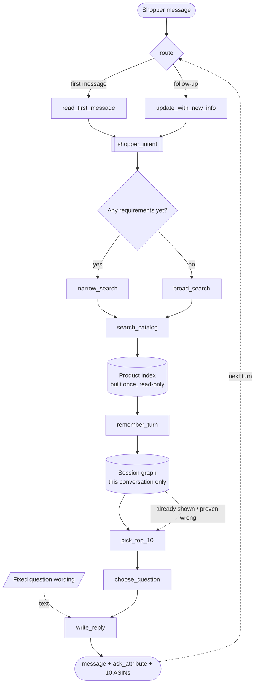

# Shopping Copilot — TikTok TechJam 2026, Track 4

A conversational shopping agent over a frozen Amazon catalog (50,000 products,
`Clothing_Shoes_and_Jewelry`). It has at most **10 turns** to surface the customer's
hidden target product inside a top-10 list.

Runs fully offline and deterministically by default: no LLM API, no network, no model
weights, no vector service — the whole index is built in memory at startup in ~17 seconds.
An optional LLM rescue exists purely for robustness and is switched off; see below.

---

## Result on the 200 public sessions

Scored by the **official, unmodified** evaluator (`evaluator/local_evaluator.py`).

| Metric | Weak BM25 starter | **This agent** |
|---|---|---|
| Hit Rate@10 | 0.125 | **0.995** |
| MRR | 0.068 | **0.690** |
| MTTC (mean turns to conversion) | 9.81 | **1.685** |
| Efficiency | 0.119 | **0.932** |
| **TechnicalScore** | **0.1067** | **0.8907** |

Per scenario:

| Scenario | n | Hit@10 | MRR | MTTC | Starter Hit@10 |
|---|---|---|---|---|---|
| buying | 80 | 0.988 | 0.722 | 1.35 | 0.238 |
| browsing | 80 | **1.000** | 0.599 | 1.29 | 0.025 |
| intent_override | 30 | **1.000** | 0.866 | 3.67 | 0.133 |
| boundary | 10 | **1.000** | 0.624 | 1.60 | 0.000 |

199 of 200 sessions convert. Median rank at conversion is **1**; 54% of sessions
convert at rank 1 and 79% within the top 3.

**Not overfitted.** Tuning used a fixed 140/60 dev/held-out split of the public set.
Held-out score **0.8856** vs dev **0.8930** — a 0.007 gap.

**Cost and speed.** 0 model tokens. 19 ms mean per turn (p95 41 ms), 17 s index build,
23 s for the full 200-session run on one core.

Raw output: [`provided/techjam-conversational-search/results_copilot.json`](provided/techjam-conversational-search/results_copilot.json).

---

## Pipeline



Built with **LangGraph**. The graph is compiled with an `InMemorySaver` checkpointer and
every turn is invoked with `thread_id = session_id`, so conversation memory is the
framework's, not the agent's. The agent object holds no per-session state.

Two nodes from the original design are **deliberately absent**: `Query expansion` and
`COSMO`. The customer's input is already structured, and widening a query that already
quotes the answer is exactly what makes the starter score 0.125. See
[docs/ARCHITECTURE.md](docs/ARCHITECTURE.md#why-query-expansion-and-cosmo-were-removed).

---

## How it works

1. **`route`** — first message or follow-up. The saved state already answers it, so
   there is nothing to classify.
2. **`read_first_message` / `update_with_new_info`** — build `shopper_intent` from the
   opening line, then update that same object every later turn. Nothing downstream ever
   reads raw user text again.
3. **`narrow_search` / `broad_search`** — branches on whether we hold any requirements
   *right now*, not on what the conversation is labelled.
4. **`search_catalog`** — an exact "must contain all of it" search leads; partial match,
   BM25F keyword scoring, colour/price filters, a category slate and an optional
   meaning-based channel are merged with Reciprocal Rank Fusion.
5. **`remember_turn`** — adds to the session graph: what was shown, at which rank, and
   whether the evaluator could have scored it.
6. **`pick_top_10`** — ranks by requirement coverage, then facet agreement, category
   overlap and a popularity prior, pushing down anything already proven wrong.
7. **`choose_question`** — picks `ask_attribute` by expected information gain, from the
   measured attribute mix and the measured selectivity of each attribute type.
8. **`write_reply`** — the sentence the shopper sees, from a fixed prompt table.

Detail and the reasoning behind each choice: **[docs/ARCHITECTURE.md](docs/ARCHITECTURE.md)**.

### LangGraph, but no LLM — why that is not a contradiction

Two different jobs get conflated here. **LangGraph is the control flow**: nodes, a
conditional branch, and saved state keyed by conversation. **An LLM is a text model.**
This agent needs the first and not the second.

- *Understanding the shopper* — the messages arrive in five fixed sentence shapes and
  their content is copied word-for-word out of the target product's listing (measured:
  760/760). A regex reads them with no loss. An LLM would paraphrase text that must stay
  byte-exact to match.
- *Picking 10 products* — this is set intersection over an index, then sorting. An LLM
  cannot read 50,000 products, and by the time you have narrowed to 10 there is nothing
  left to decide.
- *Asking a question* — `ask_attribute` is a value from a 10-item enum, chosen by
  arithmetic (`expected reveals x bits of information`). The prose next to it is ignored
  by the scorer, so it comes from a lookup table.

What we get for it: 0 tokens, 19 ms per turn, no API key, and the same answer every run —
which matters because `submission_rules.md` warns that *"organizer policy may disable
network access"* during final scoring.

**The one place a model does earn its keep** is `copilot/llm_rescue.py`, and it is off by
default. From turn 5, if the deterministic path has not converged, it re-reads the
shopper's own messages out of the session graph and returns their requirements as
structured JSON. It never ranks, never picks the question, and never produces a
`parent_asin`; a failure returns `None` and the turn continues untouched. On the clean
public set it fires 3 times in 200 conversations and changes nothing at all. Its value is
insurance: on a reworded set it lifts 0.8430 -> 0.8573 and restores hit@10 to 0.995, for
about 10k tokens across all 200 conversations.

---

## Setup

Python 3.10+.

```bash
pip install langgraph numpy scipy
# scikit-learn only if you enable the optional latent-semantic channel
```

Download the catalog (not tracked in git) and verify it:

```bash
cd provided/techjam-conversational-search/data
curl -LO https://github.com/TechJam2026/techjam-conversational-search/releases/download/participant-kit/catalog.jsonl.gz
sha256sum -c SHA256SUMS --ignore-missing     # must print: catalog.jsonl.gz: OK
gzip -dk catalog.jsonl.gz                     # -> catalog.jsonl, 50,000 rows
```

## Reproduce the results

```bash
cd provided/techjam-conversational-search

python -m evaluator.local_evaluator --output results_copilot.json
# TechnicalScore 0.890686

BASELINE=1 python -m evaluator.local_evaluator --output results_baseline.json
# TechnicalScore 0.106710  — matches docs/baseline_results.json exactly
```

Both runs are deterministic and byte-identical on repeat. The evaluator and the public
labels are unmodified; the only edited file under `provided/` is `starter/agent.py`,
which the rules designate as the entry point, and it is a shim onto `copilot/`.

## Repository layout

```text
copilot/                 the agent
  config.py              every tunable, each annotated with the measurement behind it
  text.py                normalisation shared by the index and the parser
  knowledge_graph.py     the 50k-product index: phrase lookup + BM25F + facets
  session_graph.py       what has happened in this conversation (JSON)
  understanding.py       reads the shopper's intent, then updates it each turn
  retrieval.py           the five searches, and how their results get merged
  select10.py            picks and orders the final 10 - the stage that decides the score
  ask_policy.py          decides which question is worth asking
  graph.py               LangGraph wiring: nodes, branches, saved memory
  agent.py               the Agent class the evaluator imports
docs/
  ARCHITECTURE.md        design, algorithms, ablations
  EVALUATOR_ANALYSIS.md  what the simulated customer actually does, measured
provided/                the organizer's kit, unmodified except starter/agent.py
```

---

## Limitations, and what we would do with more time

**The one miss** (`public_0020`) is a session whose entire intent card is boilerplate —
`cotton`, `Imported`, and a fabric-composition bullet shared across a whole storefront —
inside a category with ~10,000 rows. Nothing disclosed distinguishes the target. This
is a floor imposed by the data, not by the retriever.

**MRR is the remaining headroom**, not hit rate. At 0.995 hit rate the score is
`0.5·0.995 + 0.3·MRR + 0.2·Efficiency`, so lifting MRR from 0.690 to 0.86 (what
popularity ranking achieves on a *fully* disclosed card) is worth about +0.05. The
tension is real: converting at turn 1 at rank 8 scores worse than converting at turn 2
at rank 1, and we cannot choose to withhold a correct answer.

**The anonymised profile did not help.** `preference_tags` are generic ("fit",
"comfort", "durability") and match most of the catalog. Measured on the held-out split:
weight 0.0 → 0.8856, 0.3 → 0.8811, 1.2 → 0.8300. It is switched off, and the code path
is kept in case the private set ships sharper tags.

**Robustness to a paraphrased private set — now measured, not assumed.**
`harness/paraphrase_stress.py` keeps the evaluator's simulator exactly as it is (the
reveal policy lives in `customer_reply()`, not in any paraphraser) and rewrites only the
text it emits:

| | score | hit@10 |
|---|---|---|
| clean (control) | 0.8907 | 0.995 |
| carrier sentence reworded, quoted text intact | 0.8430 | 0.985 |
| + LLM rescue from turn 5 (`openai/gpt-oss-20b`) | **0.8573** | **0.995** |
| heavily reworded incl. synonym swaps | 0.8126 | 0.950 |

Recall barely moves — we still *find* the product, we just rank it lower and take a turn
longer. The loss is MRR, not misses.

The hedge that does the work is **BM25F**, not the latent-semantic channel: with LSA on,
the reworded score is 0.8403 against 0.8430 with it off.

**Cross-session learning is out of scope.** Both graphs are per-run: the knowledge graph
is read-only, the session graph dies with the session. Nothing a customer says is
written back.

## Documentation

- [docs/ARCHITECTURE.md](docs/ARCHITECTURE.md) — design and algorithms
- [docs/EVALUATOR_ANALYSIS.md](docs/EVALUATOR_ANALYSIS.md) — what the simulator does, measured
- [TRACK4_SHOPPING_COPILOT.md](TRACK4_SHOPPING_COPILOT.md) — the problem statement
- [HuyDuongArchitetureRequest.md](HuyDuongArchitetureRequest.md) — the original architecture proposal
