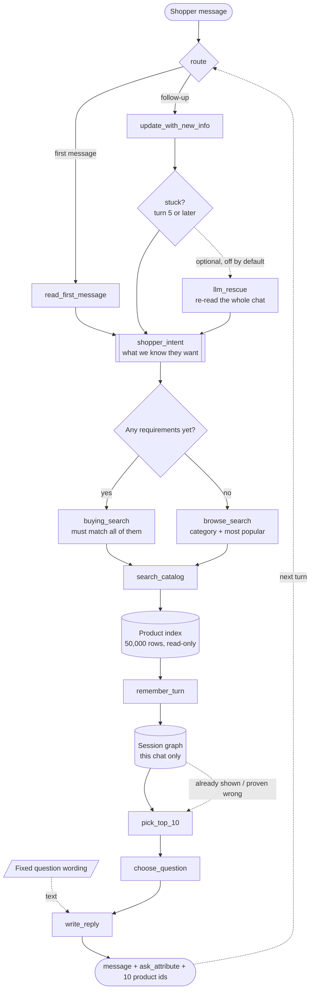

# Shopping Copilot — TikTok TechJam 2026, Track 4

A shopping agent that talks to a customer and finds the one product they are looking for,
out of a frozen Amazon catalog of 50,000 items. It gets at most **10 turns**, and the
product has to appear in a top-10 list.

It runs completely offline and gives the same answer every time. No LLM API, no internet,
no downloaded model, no vector database. The whole search index is built in memory at
startup in about 17 seconds. (There is one optional LLM step for robustness — it is
switched off, and explained near the bottom.)

---

## Result

Scored by the **official evaluator, unchanged**, on all 200 public sessions.

| Metric | Starter agent | **This agent** |
|---|---|---|
| Hit Rate@10 | 0.125 | **0.995** |
| MRR | 0.068 | **0.694** |
| MTTC (average turns to find it) | 9.81 | **1.655** |
| Efficiency | 0.119 | **0.935** |
| **TechnicalScore** | **0.1067** | **0.8927** |

Per conversation type:

| Type | n | Hit@10 | MRR | MTTC | Starter Hit@10 |
|---|---|---|---|---|---|
| buying | 80 | 0.988 | 0.713 | 1.29 | 0.238 |
| browsing | 80 | **1.000** | 0.610 | 1.29 | 0.025 |
| intent_override | 30 | **1.000** | 0.894 | 3.63 | 0.133 |
| boundary | 10 | **1.000** | 0.624 | 1.60 | 0.000 |

**199 of 200 conversations end with the right product found**, usually as the *first* item
in the list: rank 1 in 55% of conversations, top 3 in 78%.

**It is not just fitted to the test set.** All tuning used a fixed 140/60 split — tuned on
140 conversations, checked once on the other 60 at the end. Those 60 scored **0.8872**
against **0.8951** on the tuning half, a gap of 0.008.

**Cost and speed.** 0 tokens. 19 ms per turn on average (95th percentile 42 ms), 17 s to
build the index, 23 s for the whole 200-conversation run on one CPU core.

Raw output: [`results_copilot.json`](provided/techjam-conversational-search/results_copilot.json).

---

## The pipeline

One pass through this graph is one turn of the conversation.



Built with **LangGraph**. The graph saves its state after every turn, keyed by the
conversation id, so memory belongs to the framework and the agent object itself remembers
nothing between turns.

Two boxes from the original design are **gone on purpose**: `Query expansion` and `COSMO`.
The shopper's messages already quote the product we are hunting for, word for word, so
adding more words to the search only buries the answer. That is exactly the mistake that
holds the starter agent at 0.125.

---

## What each part does

**`route`** — is this the first message or a follow-up? The saved state already answers
it: it either holds a `shopper_intent` or it doesn't. Nothing to classify.

**`read_first_message`** — reads the opening line and builds `shopper_intent`: the
category, the requirements given so far, any colour or price. After this, nothing else in
the pipeline ever looks at raw text again.

**`update_with_new_info`** — every later turn, updates that same object instead of
rebuilding it. It understands the shopper adding a requirement, saying they have nothing
more to add, saying they don't mind, or changing their mind.

**`buying_search` / `browse_search`** — picks how to search this turn, based on whether we
hold any requirements *right now*. Details below.

**`search_catalog`** — five searches over the product index, merged. Details below.

**`remember_turn`** — writes the turn into the session graph: what we showed, in what
order, and whether the evaluator was able to score it.

**`pick_top_10`** — the final ranking. Sorts by how many requirements each product
satisfies, then colour/price match, then category, then popularity. Anything we already
showed and know was wrong gets pushed down.

**`choose_question`** — decides which question is worth the most before asking it, using
measured numbers rather than a fixed rule. It never stays silent.

**`write_reply`** — the sentence the shopper reads, from a fixed table of phrasings.

**`llm_rescue`** *(optional, off)* — from turn 5, if nothing has worked, re-reads the
shopper's own messages. Details below.

One document per component, starting from **[docs/ARCHITECTURE.md](docs/ARCHITECTURE.md)**.

---

## How the catalog search works

**Everything is loaded once, at startup.** All 50,000 products are read and four lookup
tables are built in memory. This takes 17 seconds and never happens again — no database,
no file reads during a conversation.

| What we build | What it is for |
|---|---|
| word → list of products containing it | finding candidates fast |
| a cleaned-up copy of each product's full text | checking an exact phrase really is in there |
| a weighted word-count table | keyword scoring (title counts 6×, features 4×, description 1.5×) |
| colour / material / price / category → products | filtering |

**The main search keeps only products that have all of it.** The shopper does not describe
the product in their own words — they quote its listing text exactly. We measured this:
**760 out of 760** things shoppers said, across all 200 conversations, are word-for-word
copies from the target product's own page. So the right move is not clever matching, it is
intersection:

```
1. For each requirement, find every product containing that exact phrase.
   We look up the 3 rarest words in it, intersect those short lists, then
   confirm the full phrase really appears. Rare words shrink the list to a
   handful before we check anything.

2. Start from the most specific requirement and intersect the rest into it.
   "73% Cotton, 25% Polyester, 2% Spandex" is in 8 products. "Imported" is in
   15,300. Starting from the specific one collapses the set in one step.

3. If nothing is left, drop the vaguest requirement and try again. Words like
   "Imported" go first - they tell us almost nothing.

4. If 10 products or fewer remain, stop and show them. Mixing in more results
   could only push the right answer out of the top 10.
```

Once the shopper has told us everything, this leaves **one product** in most conversations,
and the right answer is in the set **100% of the time**.

**Four backup searches run alongside**, for the early turns when we know very little:

| Search | Weight | When it helps |
|---|---|---|
| partial match | 3.0 | products matching *some* requirements, not all |
| keyword (BM25F) | 1.5 | when the exact phrase fails |
| colour / price / material filter | 1.0 | when the shopper states one outright |
| category + popularity | 0.8 | turn 1 of a browsing chat, when we only know the category |
| meaning-based search (optional, off) | 0.6 | spare tyre if the wording changes |

Results are merged by **Reciprocal Rank Fusion**: a product ranked 1st in one search and
5th in another scores `1/(60+1) + 1/(60+5)`. It compares *positions*, not scores, so five
very different searches do not need comparable numbers.

---

## How we tell buying from browsing

Two separate things, and the difference matters.

**The label** is read straight off the opening line, because the simulator only uses three
sentence shapes:

| The shopper says | Label |
|---|---|
| "I'm looking for X. **A key requirement is:** Y." | buying |
| "I'm looking for X, **but I'm still exploring.**" | browsing |
| "I'm looking for X. *(something else)*" | intent override |

That is 100% accurate. We record it — and then **we do not route on it.**

**The actual decision** is one line, re-checked every single turn:

```python
live = [c for c in shopper_intent["constraints"] if not c["superseded"]]
return "buying_search" if live else "browse_search"
```

In plain terms: *do we have anything concrete to search with right now?*

- **Yes → `buying_search`.** Lock the requirements in and intersect.
- **No → `browse_search`.** We only know the category, so show its most popular products
  and ask a question immediately.

**Why not use the label?** Because it points the wrong way. A conversation labelled
"intent override" hands us a *whole product feature* on turn 1. A conversation labelled
"buying" often hands us a single bare word like `cotton`. The "override" chat is the
*easier* one to search, so trusting the label would send the richer conversation down the
poorer path.

The other benefit is that the decision updates itself. A browsing chat starts with nothing,
takes the browse path, asks a question, gets two real requirements back — and from turn 2
the same line sends it down the buying path. No extra state, no separate state machine.
Browsing scores a perfect **1.000** here, against 0.025 for the starter.

---

## LangGraph, but no LLM

The first question people ask. **LangGraph and "an LLM" are two different things.**
LangGraph is the *control flow* — the boxes in the diagram, the branch in the middle, and
the memory that carries a conversation across turns. An LLM is a *text model*. This agent
needs the first and does not need the second.

Take the three jobs an LLM would normally do:

- **Understanding the shopper.** The messages come in five fixed shapes and quote the
  product's listing word for word (760/760). A regex reads that perfectly. An LLM would
  *paraphrase* text that has to stay byte-exact to match anything — it would lose
  information, not add it.
- **Picking 10 products.** Set intersection over an index, then sorting. An LLM cannot read
  50,000 products, and once we are down to 10 candidates there is nothing left to decide.
- **Asking the next question.** The evaluator does not read our sentence; it reads
  `ask_attribute`, one value from a 10-item list. Choosing among ten options is arithmetic,
  not language.

What that buys us: **0 tokens, 19 ms per turn, no API key, and the same answer every run.**
The last one matters — `submission_rules.md` warns that *"organizer policy may disable
network access"* during final scoring, so an agent that needs a model API could score zero
through no fault of its own.

### The one place a model does earn its keep

`copilot/llm_rescue.py`, **off by default**. From turn 5, if nothing has converged, it
re-reads the shopper's own messages out of the session graph and returns their requirements
as structured JSON. Those go into the same search as everything else.

It is deliberately given the narrowest possible job. It **never ranks**, **never picks the
question**, and **never produces a product id** — it only ever emits text, and every
product id still comes from the catalog index. It is handed the conversation and nothing
else, so it cannot invent a product that does not exist. Any failure returns nothing at all
and the turn continues exactly as it would have.

On the clean public set it fires 3 times in 200 conversations and changes **nothing** — our
parser already had everything. Its value is insurance: if the shopper's wording changes, it
lifts the score from 0.8440 to **0.8623** and restores Hit@10 to 0.995, for about 10,000
tokens across all 200 conversations (roughly $0.002).

---

## Setup

Python 3.10+.

```bash
pip install langgraph numpy scipy
# scikit-learn only for the optional meaning-based search
# langchain-groq (or langchain-ollama) only for the optional LLM rescue
```

Download the catalog (not stored in git) and check it:

```bash
cd provided/techjam-conversational-search/data
curl -LO https://github.com/TechJam2026/techjam-conversational-search/releases/download/participant-kit/catalog.jsonl.gz
sha256sum -c SHA256SUMS --ignore-missing     # must print: catalog.jsonl.gz: OK
gzip -dk catalog.jsonl.gz                     # -> catalog.jsonl, 50,000 rows
```

Only if you want the optional LLM rescue: copy [`.env.example`](.env.example) to `.env`
and add a key. `.env` is gitignored and must never be committed. Nothing else needs it.

## Reproduce the result

```bash
cd provided/techjam-conversational-search

python -m evaluator.local_evaluator --output results_copilot.json
# TechnicalScore 0.892686

BASELINE=1 python -m evaluator.local_evaluator --output results_baseline.json
# TechnicalScore 0.106710  - matches docs/baseline_results.json exactly
```

Run either twice and you get identical numbers. The evaluator and the public labels are
untouched; the only edited file under `provided/` is `starter/agent.py`, which the rules
name as the entry point, and it is a thin shim onto `copilot/`.

## Repository layout

```text
copilot/
  config.py            every tunable number, with a note on where it came from
  text.py              text cleanup shared by the index and the parser
  knowledge_graph.py   the 50k-product index: phrase lookup + keyword scoring + facets
  session_graph.py     what has happened in this conversation (JSON)
  understanding.py     reads the shopper's intent, then updates it each turn
  retrieval.py         the five searches and how their results are merged
  select10.py          picks and orders the final 10 - the stage that decides the score
  ask_policy.py        decides which question is worth asking
  llm_rescue.py        optional, off: re-reads the chat if we stall at turn 5
  graph.py             LangGraph wiring: nodes, branches, saved memory
  agent.py             the Agent class the evaluator calls
docs/
  ARCHITECTURE.md        how it is built and why, plus the measurements
  EVALUATOR_ANALYSIS.md  what the simulated shopper actually does
provided/                the organizer's kit, untouched except starter/agent.py
```

---

## Limits, and what we would do next

**The one miss** (`public_0020`) is a conversation whose every stated requirement is
boilerplate — `cotton`, `Imported`, and a fabric line shared across a whole storefront —
inside a category holding roughly 10,000 products. Nothing the shopper said separates the
target from the rest. That is a floor set by the data, not by the search.

**Ranking is the headroom, not finding.** At 0.995 Hit@10 the score is
`0.5 × 0.995 + 0.3 × MRR + 0.2 × Efficiency`, so lifting MRR from 0.694 towards 0.86 —
what popularity ranking reaches once a shopper has told us everything — is worth about
+0.05. The tension is real: converting on turn 1 at rank 8 scores worse than converting on
turn 2 at rank 1, and we cannot choose to hold back a correct answer.

**The shopper profile did not help.** `preference_tags` are generic ("fit", "comfort",
"durability") and match most of the catalog. Measured on the held-out half: weight 0.0 →
0.8872, 0.3 → 0.8828, 1.2 → 0.8310. It is switched off, and the code is kept in case the
private set ships sharper tags.

**If the wording changes, we degrade rather than break — measured, not assumed.**
`harness/paraphrase_stress.py` keeps the evaluator's simulator exactly as it is and rewrites
only the sentences it produces:

| | score | Hit@10 |
|---|---|---|
| unchanged (control) | 0.8927 | 0.995 |
| sentences reworded, quoted product text intact | 0.8440 | 0.985 |
| the same, with the LLM rescue on | **0.8623** | **0.995** |
| heavily reworded, including synonym swaps | 0.8136 | 0.950 |

Notice that **finding** the product barely moves — 0.995 → 0.985 → 0.950. What we lose is
rank and a turn, not the answer. The backup that does the work is the keyword search, not
the meaning-based one.

**Learning across conversations is out of scope.** Both graphs are per-run: the product
index is read-only, the session graph dies with the conversation. Nothing a shopper says is
written back.

## Documentation

Start with [docs/ARCHITECTURE.md](docs/ARCHITECTURE.md) — it is the map. One document per
component:

| Document | Covers |
|---|---|
| [ARCHITECTURE.md](docs/ARCHITECTURE.md) | the pipeline, and where everything lives |
| [INDEXING.md](docs/INDEXING.md) | what is built at startup, and what it costs |
| [TEXT_MATCHING.md](docs/TEXT_MATCHING.md) | how a shopper's words find a product |
| [RETRIEVAL.md](docs/RETRIEVAL.md) | combining what they said into a shortlist |
| [RANKING.md](docs/RANKING.md) | scoring, sorting, picking the final 10 |
| [ASK_POLICY.md](docs/ASK_POLICY.md) | deciding which question is worth asking |
| [STATE_AND_MEMORY.md](docs/STATE_AND_MEMORY.md) | the two graphs, and what LangGraph holds |
| [FORMULAS.md](docs/FORMULAS.md) | every formula and coefficient, with its justification |
| [LLM_RESCUE.md](docs/LLM_RESCUE.md) | the optional model step, off by default |
| [EVALUATOR_ANALYSIS.md](docs/EVALUATOR_ANALYSIS.md) | what the simulated shopper actually does |

Background: [TRACK4_SHOPPING_COPILOT.md](TRACK4_SHOPPING_COPILOT.md) (the problem
statement) and [HuyDuongArchitetureRequest.md](HuyDuongArchitetureRequest.md) (the original
proposal).
