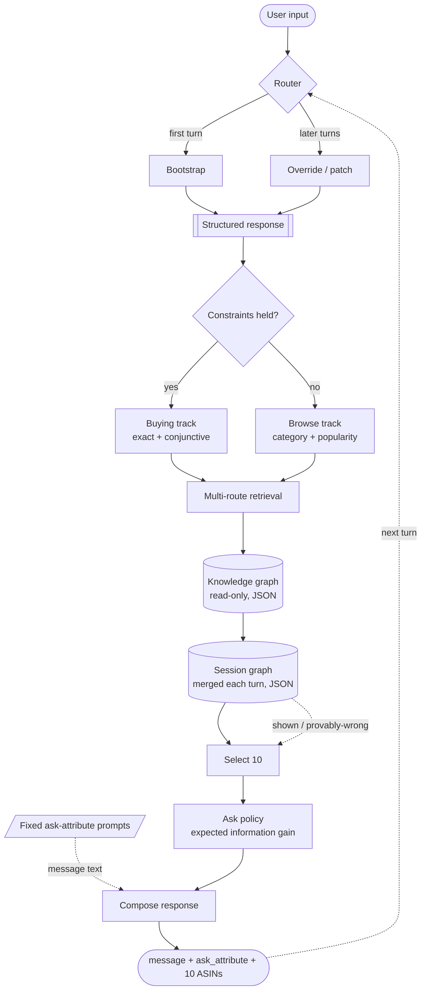

# Shopping Copilot — TikTok TechJam 2026, Track 4

A conversational shopping agent over a frozen Amazon catalog (50,000 products,
`Clothing_Shoes_and_Jewelry`). It has at most **10 turns** to surface the customer's
hidden target product inside a top-10 list.

Runs fully offline and deterministically. No LLM API, no network, no model weights,
no vector service — the whole index is built in memory at startup in ~17 seconds.

---

## Result on the 200 public sessions

Scored by the **official, unmodified** evaluator (`evaluator/local_evaluator.py`).

| Metric | Weak BM25 starter | **This agent** |
|---|---|---|
| Hit Rate@10 | 0.125 | **0.995** |
| MRR | 0.068 | **0.690** |
| MTTC (mean turns to conversion) | 9.81 | **1.685** |
| Efficiency | 0.119 | **0.932** |
| **TechnicalScore** | **0.1067** | **0.8907** |

Per scenario:

| Scenario | n | Hit@10 | MRR | MTTC | Starter Hit@10 |
|---|---|---|---|---|---|
| buying | 80 | 0.988 | 0.722 | 1.35 | 0.238 |
| browsing | 80 | **1.000** | 0.599 | 1.29 | 0.025 |
| intent_override | 30 | **1.000** | 0.866 | 3.67 | 0.133 |
| boundary | 10 | **1.000** | 0.624 | 1.60 | 0.000 |

199 of 200 sessions convert. Median rank at conversion is **1**; 54% of sessions
convert at rank 1 and 79% within the top 3.

**Not overfitted.** Tuning used a fixed 140/60 dev/held-out split of the public set.
Held-out score **0.8856** vs dev **0.8930** — a 0.007 gap.

**Cost and speed.** 0 model tokens. 19 ms mean per turn (p95 41 ms), 17 s index build,
23 s for the full 200-session run on one core.

Raw output: [`provided/techjam-conversational-search/results_copilot.json`](provided/techjam-conversational-search/results_copilot.json).

---

## Pipeline



Built with **LangGraph**. The graph is compiled with an `InMemorySaver` checkpointer and
every turn is invoked with `thread_id = session_id`, so conversation memory is the
framework's, not the agent's. The agent object holds no per-session state.

Two nodes from the original design are **deliberately absent**: `Query expansion` and
`COSMO`. The customer's input is already structured, and widening a query that already
quotes the answer is exactly what makes the starter score 0.125. See
[docs/ARCHITECTURE.md](docs/ARCHITECTURE.md#why-query-expansion-and-cosmo-were-removed).

---

## How it works

1. **Router** — first turn vs. follow-up. Then a *track* branch on how much constraint
   text is actually held, not on the scenario label.
2. **Structured response** — the session's query state. Built once from the opening
   message, then JSON-patched on every later turn. Nothing downstream ever reads raw
   user text.
3. **Knowledge graph** — the 50k catalog, indexed once, read-only. Product nodes carry
   facets (material, colour, department, price, popularity); token postings, a
   field-weighted BM25F matrix and a normalised text rendering serve retrieval.
4. **Multi-route retrieval** — an exact/conjunctive channel leads; phrase-coverage,
   BM25F, structured facet filters, a category slate and an optional latent-semantic
   channel are fused with Reciprocal Rank Fusion.
5. **Session graph** — merged every turn: what was shown, at which rank, and whether
   the evaluator could have scored it. Feeds demotion back into Select 10.
6. **Select 10** — ranks by constraint coverage, then facet agreement, category overlap
   and a popularity prior, demoting anything provably wrong.
7. **Ask policy** — picks `ask_attribute` by expected information gain, computed from
   the measured attribute mix and the measured selectivity of each attribute type.

Detail and the reasoning behind each choice: **[docs/ARCHITECTURE.md](docs/ARCHITECTURE.md)**.

---

## Setup

Python 3.10+.

```bash
pip install langgraph numpy scipy
# scikit-learn only if you enable the optional latent-semantic channel
```

Download the catalog (not tracked in git) and verify it:

```bash
cd provided/techjam-conversational-search/data
curl -LO https://github.com/TechJam2026/techjam-conversational-search/releases/download/participant-kit/catalog.jsonl.gz
sha256sum -c SHA256SUMS --ignore-missing     # must print: catalog.jsonl.gz: OK
gzip -dk catalog.jsonl.gz                     # -> catalog.jsonl, 50,000 rows
```

## Reproduce the results

```bash
cd provided/techjam-conversational-search

python -m evaluator.local_evaluator --output results_copilot.json
# TechnicalScore 0.890686

BASELINE=1 python -m evaluator.local_evaluator --output results_baseline.json
# TechnicalScore 0.106710  — matches docs/baseline_results.json exactly
```

Both runs are deterministic and byte-identical on repeat. The evaluator and the public
labels are unmodified; the only edited file under `provided/` is `starter/agent.py`,
which the rules designate as the entry point, and it is a shim onto `copilot/`.

## Repository layout

```text
copilot/                 the agent
  config.py              every tunable, each annotated with the measurement behind it
  text.py                normalisation shared by the index and the parser
  knowledge_graph.py     global catalog graph + BM25F / postings / phrase verification
  session_graph.py       per-session conversation graph (JSON)
  understanding.py       Structured Response: build on turn 1, patch afterwards
  retrieval.py           conjunctive + phrase + BM25F + facet + category + LSA, RRF-fused
  select10.py            the reranker that decides the score
  ask_policy.py          expected-information-gain clarification policy
  graph.py               LangGraph wiring: router, nodes, checkpointed memory
  agent.py               the Agent class the evaluator imports
docs/
  ARCHITECTURE.md        design, algorithms, ablations
  EVALUATOR_ANALYSIS.md  what the simulated customer actually does, measured
provided/                the organizer's kit, unmodified except starter/agent.py
```

---

## Limitations, and what we would do with more time

**The one miss** (`public_0020`) is a session whose entire intent card is boilerplate —
`cotton`, `Imported`, and a fabric-composition bullet shared across a whole storefront —
inside a category with ~10,000 rows. Nothing disclosed distinguishes the target. This
is a floor imposed by the data, not by the retriever.

**MRR is the remaining headroom**, not hit rate. At 0.995 hit rate the score is
`0.5·0.995 + 0.3·MRR + 0.2·Efficiency`, so lifting MRR from 0.690 to 0.86 (what
popularity ranking achieves on a *fully* disclosed card) is worth about +0.05. The
tension is real: converting at turn 1 at rank 8 scores worse than converting at turn 2
at rank 1, and we cannot choose to withhold a correct answer.

**The anonymised profile did not help.** `preference_tags` are generic ("fit",
"comfort", "durability") and match most of the catalog. Measured on the held-out split:
weight 0.0 → 0.8856, 0.3 → 0.8811, 1.2 → 0.8300. It is switched off, and the code path
is kept in case the private set ships sharper tags.

**Robustness to a paraphrased private set.** The simulator's reveal policy lives in the
evaluator, not in any paraphraser, so the *information* would still arrive; only exact
matching would degrade. Three hedges are in place: a span-extraction fallback in the
parser, the BM25F channel, and the latent-semantic channel (`enable_lsa=True`, ships no
model weights). LSA measures neutral on the public set — 0.8861 vs 0.8862, which is
itself the evidence that the public set carries no semantic content at all.

**Cross-session learning is out of scope.** Both graphs are per-run: the knowledge graph
is read-only, the session graph dies with the session. Nothing a customer says is
written back.

## Documentation

- [docs/ARCHITECTURE.md](docs/ARCHITECTURE.md) — design and algorithms
- [docs/EVALUATOR_ANALYSIS.md](docs/EVALUATOR_ANALYSIS.md) — what the simulator does, measured
- [TRACK4_SHOPPING_COPILOT.md](TRACK4_SHOPPING_COPILOT.md) — the problem statement
- [HuyDuongArchitetureRequest.md](HuyDuongArchitetureRequest.md) — the original architecture proposal
