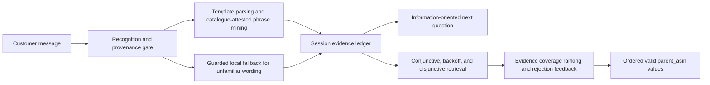

# Grounded Multi-Turn Product Search

Our submission for the TechJam Conversational E-Commerce Search Challenge. It replaces the
starter BM25 agent with a catalogue-grounded conversational retrieval system that maintains
session state, handles intent overrides, asks information-oriented clarification questions,
and ranks exact catalogue `parent_asin` values.

The repository preserves the official participant kit: the public development sessions,
unmodified evaluator, API contract, scoring configuration, final-evaluation FAQ, and
organizer evaluator tests. Our contribution is isolated in [`submission/`](submission/) and
is exposed to the official harness through [`starter/agent.py`](starter/agent.py).

## Results

On the official 200-session public development set, using the unmodified organizer evaluator:

| Hit Rate@10 | MRR | MTTC | TechnicalScore |
|---:|---:|---:|---:|
| 0.9950 | 0.9950 | 2.225 | **0.971500** |

The released BM25 starter records TechnicalScore 0.106710 on the same set.

## Architecture



The core path is deterministic. Every phrase used as retrieval evidence must be attested in
the frozen catalogue. This makes the recommendation process auditable and prevents a model
from adding unsupported requirements.

For unfamiliar wording, the system includes a guarded route classifier, token tagger, and
exact lookup against the included catalogue-derived attribute dictionary. Two optional Groq
helpers can resolve an unattested attribute phrase or recover missed evidence from a stalled
conversation. Both must pass the same catalogue-attestation check before affecting retrieval.

## Setup and reproduction

Use Python 3.10 or later. Download the organizer catalogue release and place
`catalog.jsonl` at `data/catalog.jsonl`, as described in [`data/README.md`](data/README.md).

```bash
python -m pip install -r requirements.txt
python -m evaluator.local_evaluator
```

The command uses the unmodified official evaluator and writes `results.json`. The evaluator
imports `starter.agent.Agent`, which re-exports the canonical implementation in
`submission.agent.Agent`.

Run the organizer's evaluator test with:

```bash
python -m unittest discover -s tests -v
```

Run the required public multi-turn demonstration with:

```bash
python -m submission.demo --sample-id public_0002
```

It prints each customer message, structured question, recommendation list, token usage, and
the public target's rank. It uses only the released public session and official simulator.

## Optional Groq configuration

No API key or network access is required for the reported public result. To enable the
optional semantic recovery helpers, copy [`.env.example`](.env.example) to `.env` and set
`GROQ_API_KEY`, or export it in the environment. The key is never committed.

Without a key, no hosted request is made. With a key, the resolver and transcript rescue are
conservative fallbacks: their proposed evidence is discarded unless it is present in the
frozen catalogue. The response always reports non-negative prompt and completion token usage.

## Runtime, model, and cost disclosure

- Python: 3.10 or newer. Dependencies are `torch` and `transformers`; the core retrieval
  path otherwise uses the standard library and in-memory SQLite FTS5.
- Measured public result: the exact, offline path reports zero prompt and completion tokens.
  The score is reproducible without a network connection or API key.
- Measured latency: 17.93 seconds for the complete 200-session public evaluation, including
  catalogue index construction, in the final local audit environment.
- Local models: guarded DistilBERT route and token-tagging checkpoints,
  `KhiemGOM/techjam-route-classifier` and `KhiemGOM/techjam-scaffolding-tagger`. They are
  lazily loaded only for unfamiliar message wording; if unavailable, the agent uses its
  deterministic lexical fallback.
- Hosted model: optional Groq `openai/gpt-oss-20b` for the resolver and transcript rescue.
  It requires `GROQ_API_KEY`, is never called without one, and uses the account and pricing
  chosen by the team running evaluation.
- Estimated official-evaluation cost: **$0.00** for the documented offline configuration.
  Optional hosted usage is not required for the reported score and must be budgeted by the
  credential owner.
- Hardware: the public-score run was performed on a Windows development laptop. The official
  exact-template path does not invoke the optional local checkpoints or require a GPU.

## Repository layout

| Path | Purpose |
|---|---|
| [`starter/agent.py`](starter/agent.py) | Official evaluator entry point, re-exporting our Agent |
| [`submission/`](submission/) | Our agent, guarded fallback modules, dictionary, setup details |
| [`evaluator/`](evaluator/) | Unmodified organizer local evaluator |
| [`data/public_set.jsonl`](data/public_set.jsonl) | Organizer public development sessions |
| [`docs/`](docs/) | Organizer contract, rules, score configuration, and final-evaluation FAQ |
| [`tests/`](tests/) | Organizer evaluator tests |

The exhaustive research record, internal robustness suites, experiment logs, and web
demonstration are retained on the [`full` branch](https://github.com/DanielNg0729/L-GPT/tree/full).
They are intentionally excluded from this final-evaluation branch.

## Limitations and next steps

The deterministic path benefits from the organizer's documented fixed message templates and
catalogue-derived constraints. The guarded semantic fallbacks are designed for unfamiliar
wording, but their local model weights are loaded lazily and the external recovery helpers
depend on a user-supplied Groq credential. Given more time, we would package a compact local
model artifact and validate against an organizer-provided target-disjoint set.

## Team contributions

This project was developed by the submitting team. Add individual member names and specific
responsibilities here before final Devpost submission if the team is not solo.
