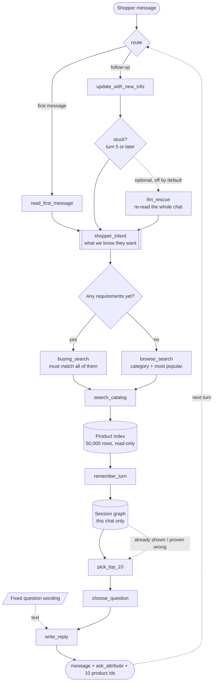

# Architecture

How the agent is put together, and where to find the detail on each part.

Every number in these documents is measured against the real 50,000-row catalog and the 200
public conversations. The measurement scripts live outside this repository, in `analysis/`
and `harness/`.

---

## The documents

| Document | Covers |
|---|---|
| **[INDEXING.md](INDEXING.md)** | what is built at startup, and what it costs |
| **[TEXT_MATCHING.md](TEXT_MATCHING.md)** | how a shopper's words find a product |
| **[RETRIEVAL.md](RETRIEVAL.md)** | combining everything they said into a shortlist |
| **[RANKING.md](RANKING.md)** | scoring, sorting, and picking the final 10 |
| **[ASK_POLICY.md](ASK_POLICY.md)** | deciding which question is worth asking |
| **[STATE_AND_MEMORY.md](STATE_AND_MEMORY.md)** | the two graphs, and what LangGraph holds |
| **[FORMULAS.md](FORMULAS.md)** | every formula and coefficient, with its justification |
| **[LLM_RESCUE.md](LLM_RESCUE.md)** | the optional model step, off by default |
| **[EVALUATOR_ANALYSIS.md](EVALUATOR_ANALYSIS.md)** | what the simulated shopper actually does |

Start with EVALUATOR_ANALYSIS if you want the *why* behind everything else. One measurement
there drives the entire design.

---

## The pipeline

One pass through this graph is one turn of the conversation.



Implemented as a LangGraph `StateGraph` in [`copilot/graph.py`](../copilot/graph.py):

| Node | Code | Does | Detail |
|---|---|---|---|
| `route` | `graph.py` | first message or follow-up | — |
| `read_first_message` | `understanding.py` | build the shopper's intent | [STATE_AND_MEMORY](STATE_AND_MEMORY.md#4-the-shoppers-intent) |
| `update_with_new_info` | `understanding.py` | update it; handle change of mind | [STATE_AND_MEMORY](STATE_AND_MEMORY.md#4-the-shoppers-intent) |
| `llm_rescue` | `llm_rescue.py` | *(optional, off)* re-read the chat | [LLM_RESCUE](LLM_RESCUE.md) |
| `buying_search` / `browse_search` | `graph.py` | pick the search mode for this turn | below |
| `search_catalog` | `retrieval.py` | run the searches, merge them | [RETRIEVAL](RETRIEVAL.md) |
| `remember_turn` | `session_graph.py` | record the turn | [STATE_AND_MEMORY](STATE_AND_MEMORY.md) |
| `pick_top_10` | `select10.py` | rank and cut to ten | [RANKING](RANKING.md) |
| `choose_question` | `ask_policy.py` | choose `ask_attribute` | [ASK_POLICY](ASK_POLICY.md) |
| `write_reply` | `graph.py` | the sentence the shopper reads | — |

---

## Buying or browsing: what we actually branch on

The **label** is read off the opening line and is 100% accurate — the simulator uses three
fixed sentence shapes. We record it, and then we do not route on it.

The **decision** is one line, re-checked every turn:

```python
live = [c for c in shopper_intent["constraints"] if not c["superseded"]]
return "buying_search" if live else "browse_search"
```

*Do we have anything concrete to search with right now?* Yes → lock the requirements in and
intersect. No → show the category's most popular products and ask immediately.

**Why not the label?** It points the wrong way. A conversation labelled "intent override"
hands us a whole product feature on turn 1; one labelled "buying" often hands us a single
word like `cotton`. The "override" chat is the *easier* one to search, so trusting the label
would send the richer conversation down the poorer path.

The decision also updates itself. A browsing chat starts with nothing, takes the browse path,
asks, gets two real requirements back — and from turn 2 the same line sends it down the
buying path. No extra state, no separate state machine.

---

## Why Query expansion and COSMO were removed

The original proposal put an LLM query-expansion step and a commonsense-enrichment step in
front of everything. Both are gone.

The shopper's input is already structured, and its content is **verbatim text from the target
product's own listing** — measured at 760 out of 760 requirements. There is no hidden intent
to recover and no commonsense gap to fill.

Worse, expansion actively hurts. The starter agent widens the query into
`" OR ".join(terms)` and scores 0.125, because the requirements are dominated by boilerplate:
`Imported` appears in 15,300 listings, `Machine Wash` in 10,032. Widening a query that
already quotes the answer buries it.

What replaces them is a deterministic parser plus a fallback that keeps unrecognised text as
a low-weight span, so a reworded private set degrades to keyword search rather than failing.

---

## Result

Official evaluator, unchanged, 200 public conversations:

| Metric | Starter | This agent |
|---|---|---|
| Hit@10 | 0.125 | **0.995** |
| MRR | 0.068 | **0.694** |
| MTTC | 9.81 | **1.655** |
| Efficiency | 0.119 | **0.935** |
| **TechnicalScore** | **0.1067** | **0.8927** |

| Type | n | Hit@10 | MRR | MTTC |
|---|---|---|---|---|
| buying | 80 | 0.988 | 0.713 | 1.29 |
| browsing | 80 | 1.000 | 0.610 | 1.29 |
| intent_override | 30 | 1.000 | 0.894 | 3.63 |
| boundary | 10 | 1.000 | 0.624 | 1.60 |

Tuned on a fixed 140/60 split: held-out **0.8872**, tuning half **0.8951**.

---

## Robustness

`harness/paraphrase_stress.py` keeps the evaluator's simulator exactly as it is and rewrites
only the sentences it produces.

| | score | Hit@10 |
|---|---|---|
| unchanged (control) | 0.8927 | 0.995 |
| sentences reworded, quoted product text intact | 0.8440 | 0.985 |
| the same, with the LLM rescue on | **0.8623** | **0.995** |
| heavily reworded, including synonym swaps | 0.8136 | 0.950 |

**Finding** the product barely moves: 0.995 → 0.985 → 0.950. What we lose is rank and a turn,
not the answer. The backup doing that work is keyword scoring, not the meaning-based channel.

---

## Reproducing

```bash
cd provided/techjam-conversational-search
python -m evaluator.local_evaluator --output results_copilot.json   # 0.892686
BASELINE=1 python -m evaluator.local_evaluator                      # 0.106710
python -m pytest tests/ -q                                          # 3 passed
```

Deterministic — repeat runs are identical. The evaluator and the public labels are untouched.

Guarantees enforced in code: `respond()` can never raise (an exception is scored as a miss,
so failure degrades to a popularity-ranked list), the turn counter is clamped to 10,
`recommendations` is never empty, and `ask_attribute` is always inside the contract's enum.
