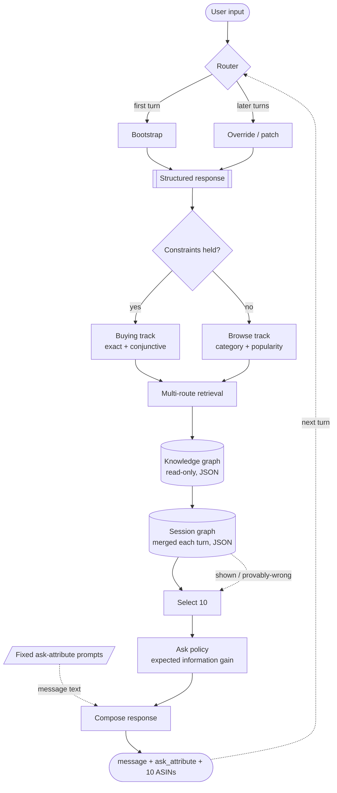

# Architecture

How the agent is built, and why each part is the way it is. Every number quoted here is
measured against the real 50,000-row catalog and the 200 public sessions — the
measurement scripts live outside this repo, in `analysis/` and `harness/`.

Companion document: [EVALUATOR_ANALYSIS.md](EVALUATOR_ANALYSIS.md), which establishes
what the simulated customer actually does. Read that first if you want the *why* behind
the retrieval design.

---

## 1. The pipeline



Implemented as a LangGraph `StateGraph` in [`copilot/graph.py`](../copilot/graph.py):

| Node | File | Does |
|---|---|---|
| `router` | `graph.py` | first turn vs. follow-up |
| `bootstrap` | `understanding.py` | create the Structured Response |
| `patch` | `understanding.py` | JSON-patch it; handle override, boundary, exhaustion |
| `buying_track` / `browse_track` | `graph.py` | dual-track routing |
| `rag` | `retrieval.py` | run every channel, fuse with RRF |
| `session_update` | `session_graph.py` | merge the turn into the session graph |
| `select_10` | `select10.py` | rank and emit 10 ASINs |
| `ask` | `ask_policy.py` | choose `ask_attribute` |
| `compose` | `graph.py` | customer-facing text |

### Memory

The graph is compiled with an `InMemorySaver` checkpointer, and each turn is invoked
with `thread_id = session_id`. LangGraph therefore owns the conversation memory; the
`Agent` object holds no per-session state beyond the user profile.

Two things stay *out* of the checkpointed state on purpose:

- the **knowledge graph** — global, read-only, shared by every session. Putting 50,000
  product nodes through a checkpointer on every turn would be absurd. It is bound into
  the node closures.
- the **per-turn numpy artifacts** (candidate pool, coverage vector) — they travel from
  `rag` to `select_10` through a scratch dict keyed by session id.

What is left in the state is small, JSON-clean and replayable: the Structured Response,
the Session Graph, and the turn's outputs.

---

## 2. The two graphs

Both are plain JSON dicts. There is no graph database.

| | Knowledge graph | Session graph |
|---|---|---|
| Scope | global, all sessions | one conversation |
| Written | once, at startup | every turn |
| Lifetime | the whole run | dies with the session |
| File | `knowledge_graph.py` | `session_graph.py` |

### Knowledge graph

50,000 product nodes, each carrying `category_path`, `price`, `rating_number`,
`average_rating`, a derived `popularity`, and facet values for material, colour,
department and store. Reverse indexes point from facet, category and token back to
product nodes. `to_json()` round-trips the whole thing.

Three structures are derived at build time for retrieval:

- `postings` — token → sorted product ids, used to seed phrase lookup
- `matrix` — field-weighted term-frequency CSR, used for BM25F
- `doc_norm` — punctuation-stripped rendering of each row, used to *verify* that a
  candidate really contains a phrase verbatim

`doc_norm` is the load-bearing one. It renders a row exactly the way the evaluator's own
`searchable_text()` does, then strips punctuation. That single detail lifts the
constraint-is-a-verbatim-substring rate from 0.9934 to **1.0000**, because the evaluator
flattens the `details` dict as `"Department Womens"` while the intent card quotes it as
`"Department: Womens"`.

Build cost: **17 s**, 50,000 rows, 100,999 distinct tokens, single-threaded, in memory.

### Session graph

Records per turn: the message, the track, constraints learned, the slate shown with
ranks, attribute nodes with provenance, exhausted attributes, and `rejected_by_user`
edges (marked, never deleted — delete one and the next retrieval returns the same item).

One rule in it is subtle enough to be worth stating loudly:

> A product shown on an earlier turn is **not** automatically known to be wrong. The
> evaluator suppresses hits in an intent-override session until the override lands, so a
> product shown at turn 1 of such a session may still be the target.

`record_shown()` therefore takes a `hit_would_count` flag, and the exclusion is a
*demotion*, not a deletion. Getting this wrong cost real points — see §6.

---

## 3. Why Query expansion and COSMO were removed

The original proposal put an LLM query-expansion step and a COSMO commonsense-enrichment
step in front of the Structured Response. Both are gone.

The customer's input is already structured. Its utterances come from a small set of
fixed templates, and their payload is *verbatim text from the target product's own
catalog row* — measured at **760 / 760** revealed constraints. There is no implicit
intent to recover and no commonsense gap to fill.

Worse, expansion actively hurts. The starter agent widens the query into
`" OR ".join(terms)` and scores 0.125, because the disclosed constraints are dominated
by boilerplate: `Imported` appears in 13,994 rows, `Machine Wash` in 9,030. Widening a
query that already quotes the answer buries it.

What replaces them, in [`understanding.py`](../copilot/understanding.py), is a
deterministic template parser plus a span-extraction fallback. On turn 1 it builds the
Structured Response; on later turns it patches it. It never rebuilds. Unrecognised text
falls through to the low-weight span path, so a paraphrased private set degrades to
BM25-over-extracted-spans rather than failing.

---

## 4. Retrieval

The customer quotes the target row, so the exact/conjunctive channel is not one channel
among equals — it is the answer. Everything else covers the turns where too little has
been disclosed.

Measured on the 200 public sessions with the full intent card revealed:

```text
AND of every disclosed constraint  ->  pool contains the target   100.0%
                                       median pool size            1
                                       pool <= 10                 74.0%
                                       needed a backoff drop       0.0%
```

### The conjunctive channel

```text
1. For each disclosed constraint, look up the rows containing it verbatim.
   Seed candidates from the two rarest tokens via the postings index, then
   verify containment against doc_norm.
2. Sort constraints most-selective-first and intersect.
3. If the intersection empties, drop one member and retry. Backoff order:
   superseded first, then highest document frequency first — boilerplate is
   the cheapest thing to give up.
4. If 1 <= |pool| <= 10, emit it directly. Fusing other channels into a pool
   that small could only push the target out of the scored top 10.
```

### The other channels, fused by RRF

| Channel | Weight | Role |
|---|---|---|
| `conjunctive` | 6.0 | the pool above |
| `phrase` | 3.0 | union of per-constraint matches, scored by weighted coverage |
| `bm25` | 1.5 | field-weighted BM25F over constraint + category tokens |
| `facet` | 1.0 | structured filters: material / colour / price / department |
| `category` | 0.8 | category-path match, popularity-ordered — the browsing cold start |
| `lsa` | 0.6 | optional TF-IDF + TruncatedSVD cosine; ships no model weights |

Reciprocal Rank Fusion (`k = 60`) needs no score calibration across heterogeneous
retrievers, which is why it is the standard industrial choice.

### Two things deliberately kept out of the AND

**The stated category.** It looks like a verbatim phrase but is not one: the simulator
builds it from `categories[-2:]` after dropping generic segments, so `"Women Bodysuits"`
is stitched from a path that reads `"Women Clothing Bodysuits"` in the row itself.
ANDing it matched a handful of unrelated rows and *silently excluded the target*. It
enters as a ranking signal and as its own channel instead — and it matters: setting
`w_category = 0` drops the score from 0.891 to 0.809.

**The customer's colour and price facets.** Folding them into the AND tightens the pool
and converts marginally earlier, but at a slightly worse rank — 0.8830 against 0.8862.
Rank is worth about 13× a turn here (§7), so they stay out. The switch is
`RetrievalConfig.fold_facets_into_and`, default off.

---

## 5. Select 10

Ranking signals, strongest first:

1. **Constraint coverage** (weight 10) — how much of the disclosed card the row
   satisfies verbatim.
2. **Facet agreement** (2) — colour, price, material, department.
3. **Category-path overlap** (3).
4. **Popularity prior** (0.9) — `log1p(rating_number) × average_rating / 5`.
5. **Demotion** (−4) — rows already shown on a turn where a hit *would* have been
   scored; the session continuing proves they were wrong.

The popularity prior does more work than it looks like it should. Targets are real
purchase records, so they skew toward well-reviewed, frequently-bought rows: ranking a
fully-disclosed conjunctive pool by popularity **alone** measures HitRate@10 0.945 and
MRR 0.861. We compared eight priors (raw count, log, sqrt, Wilson-style, average rating,
title length); they land within 0.005 MRR of each other, so the shape does not matter —
only that popularity is used at all.

`select()` never returns an empty list. If nothing matched, it falls back to the most
popular rows in the stated category, then to the most popular rows overall. Every turn
is scored, so an empty slate throws away a free shot.

---

## 6. The ask policy

The tempting move is to hardcode `ask_attribute = "other"`, because the simulator
short-circuits its type check for `"other"` and returns the first two undisclosed
constraints of any type. That works, but it is a magic constant with no justification
and it breaks if the private set changes the reveal policy.

So it is computed instead:

```text
EIG(a) = E[constraints revealed | ask a] × E[bits per constraint | a]
```

Both expectations are measured, not guessed:

- `P(a)` — the attribute mix of the 760 constraints in the 200 public cards:
  feature 0.53, material 0.40, colour 0.08, style 0.025, size 0.014, use_case 0.005.
- bits — mean `log2(50000 / catalog_df)` per attribute type: feature 6.84,
  material 6.43, and 15.4–15.6 for colour / style / size / use_case (those are almost
  always unique rows, but they are rare).

The unrestricted ask matches *any* undisclosed constraint, so its `P` is 1.0 and it wins
on expectation until the card runs dry. The policy therefore **derives** `"other"`
rather than assuming it, and switches to typed asks once the unrestricted channel is
exhausted.

**It never emits a null ask.** The simulator answers `null` with *"Ask me about one
specific attribute"* — a turn that reveals nothing. A small candidate pool is not
evidence that the target is in it; it only means the constraints we hold happen to
intersect tightly, which is exactly what happens when we hold too few of them. Leaving
the "pool is small, stop asking" rule in place deadlocked **6 of 200 sessions** to turn
10. The escape hatch survives as `AskConfig.allow_null_ask`, default off.

Asking costs nothing here: a turn carries `message`, `ask_attribute` *and*
`recommendations` at once, and the hit is checked before the customer replies. So the
policy never trades a recommendation slot for a question.

---

## 7. Intent override

`behavior_for()` derives the "new" intent from `hard_constraints[0]` of the *same*
target product, so on the public set the pivot is usually a restatement of something the
customer already said. Two bugs came out of treating it as a real pivot:

**Down-weighting everything else destroys a correct ranking.** Measured: a target
sitting at rank 1 on turn 3 fell outside the top 10 on turn 4, purely because the
override marked the earlier constraints superseded. The fix distinguishes the two cases
— if the new value is already known it is a *re-affirmation* (boost it, keep the rest at
full weight); only a genuinely new value triggers a pivot, and even then the earlier
constraints are down-weighted to 0.35 rather than deleted. "Ignore my earlier
preference" does not say *which* one.

**Guessing the override turn corrupts the session graph.** The override lands on turn 3
*or* 4 and we cannot tell which in advance. Assuming 3 marks a correct turn-3 slate
"provably wrong" and demotes the real target on turn 4. So `hit_blocked_until` starts at
`MAX_TURNS + 1` and is only lowered when the override message is actually observed.

Both fixes together took intent_override from Hit@10 0.767 to **1.000**.

---

## 8. What the metric algebra says to optimise

Substituting `MTTC = h·t̄ + (1−h)·11` into `Efficiency = (11 − MTTC)/10` gives an exact
identity:

```text
Efficiency     = HitRate × (11 − mean_hit_turn) / 10   ≤ HitRate
TechnicalScore = HitRate × (0.50 + 0.02 × (11 − t̄)) + 0.30 × MRR
```

Since `MRR ≤ h` and `Efficiency ≤ h`:

> **TechnicalScore ≤ HitRate@10.** MRR and Efficiency are only discount factors on it.

Two consequences that shaped every decision above:

- **Recall first.** The coefficient on hit rate moves only from 0.62 (`t̄` = 5) to 0.68
  (`t̄` = 2), so speed is worth roughly a quarter of recall. Never trade recall for turns.
- **Once recall is saturated, rank beats speed by ~13×.** At 0.995 hit rate, converting
  at rank 1 on turn 2 instead of rank 8 on turn 1 gains `0.3 × 0.875 = 0.26` of MRR
  weight and costs `0.02` of efficiency weight.

The published baseline is consistent with this: decomposing `h = 0.125, MTTC = 9.81`
gives `t̄ = 1.48`, which reconstructs Efficiency to 0.119000 exactly. The starter's
ranking and speed were fine; it simply missed 87.5% of sessions.

---

## 9. Ablations

Every configuration run on the same fixed 140/60 dev/held-out split of the public set.
Tuning read the held-out column; a change that won on dev and lost on held-out was
treated as noise and dropped.

| Configuration | dev (140) | held-out (60) | all (200) |
|---|---|---|---|
| **shipped** (`w_category=3.0`, `w_profile=0.0`) | **0.8930** | **0.8856** | **0.8907** |
| `w_category = 1.5` | 0.8884 | 0.8811 | 0.8862 |
| `w_category = 0` (no category signal) | 0.8096 | 0.8059 | 0.8085 |
| `w_profile = 0.3` | 0.8884 | 0.8811 | 0.8862 |
| `w_profile = 1.2` | 0.8614 | 0.8300 | 0.8517 |
| `demote_shown = 0` (no session-graph feedback) | 0.8687 | 0.8579 | 0.8654 |
| facets folded into the AND | 0.8851 | 0.8784 | 0.8830 |
| latent-semantic channel on | 0.8885 | 0.8805 | 0.8861 |

Read three things off this table:

- **The category signal is worth 0.082.** Larger than anything else measured.
- **Session-graph demotion is worth 0.025.** The feedback edge earns its place.
- **The latent-semantic channel is worth nothing — 0.8861 against 0.8862.** That is not
  a failure of the channel; it is direct evidence that the public set carries no
  semantic content for it to find. It stays off by default and remains available as the
  paraphrase hedge for the private set.

---

## 10. Reproducing

```bash
cd provided/techjam-conversational-search
python -m evaluator.local_evaluator --output results_copilot.json    # 0.890686
BASELINE=1 python -m evaluator.local_evaluator                       # 0.106710
```

Deterministic: repeat runs are byte-identical. The evaluator and the public labels are
unmodified.

Guarantees enforced in code: `respond()` never raises (an exception is scored as a miss,
so failure degrades to a popularity-ranked slate); the turn counter is clamped to 10;
`recommendations` is never empty; `ask_attribute` is always inside the contract enum.
