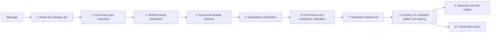

# V2 Semantic Roadmap and Experiment Contract

## Governing rule

Every semantic change is an isolated experiment before it can influence the submission.
No semantic component may replace exact catalogue evidence, modify V1 behavior by default,
or be accepted solely because it improves a synthetic development set.

**Continuity checkpoint.** At the start of any resumed or compacted working context,
re-read this roadmap before selecting the next semantic experiment. The current-node table
is the source of truth for what is complete, blocked, or still only a baseline.

## Non-interference contract

Every candidate must report all of the following before adoption:

| Suite | Required outcome |
|---|---|
| Official200 canonical replay | No score regression; semantic contribution must be zero or empirically harmless |
| Unseen800 canonical population | No score regression; semantic contribution must be zero or empirically harmless |
| Public value-only semantic development | Improvement over the declared baseline |
| Public value-only semantic holdout | Improvement without post-hoc tuning |
| Legacy target-disjoint semantic shift | Reported as secondary transfer evidence, never used as the sole adoption criterion |
| Override stress suite | No regression when no true semantic contradiction exists |

## Gate taxonomy and node assignment

The labels below describe the gate required before a node can alter V1 behaviour.
They do not describe model quality. A model may execute for diagnostics while its
effective ranking weight remains zero.

| Gate class | Meaning |
|---|---|
| **G1: exact exclusion** | A deterministic predicate proves that the message remains on the released literal path. The semantic node is unreachable on that traffic. |
| **G2: pessimistic hard signal** | The predicate is not a logical proof, but a deliberately conservative threshold can make activation empirically zero on Official200 and Unseen800. |
| **G3: soft attenuation** | The node may run on canonical traffic. A calibrated confidence and separate semantic weight must make its effective contribution zero, or empirically harmless, there. |
| **G4: learned decision required** | No safe structural predicate identifies when the action is correct. A learned semantic decision, evaluated on dedicated counterfactual data, is required before it can change V1 state. |

| Node | Required gate class | Exact reason and operational rule |
|---|---|---|
| 1. Route | **G1** | `recognised(message)` matches every released organizer wrapper. When true, the classifier is unreachable. V2.23 measured zero model loads and zero inferences on Official200 and Unseen800. |
| 2. Span extraction | **G1** | The same literal wrapper gate selects the existing template parser. With preserved wrappers, V2.03 recovered 460 of 460 exposed values verbatim. A learned span extractor is only eligible after wrapper recognition fails. |
| 3. Attribute family | **G3** | Family prediction is not evidence by itself and top-one routing is only 0.5351. It may narrow a semantic candidate search, but must retain a global fallback and may not delete literal evidence or hard-prune V1 candidates. |
| 4. Canonical attribute retrieval | **G3** | Absence of a useful literal resolution is a necessary entry condition, not proof that a semantic nearest neighbour is correct. The retrieved phrase therefore needs calibrated weak evidence, not a hard replacement. |
| 5. Equivalence verification | **G3** | Similarity and margin are continuous, and the pretrained verifier AUROC is 0.7758 rather than a proof. It can attenuate or reject a semantic candidate, but cannot be the sole hard gate. |
| 6. Calibration and provenance | **G3** | This is the explicit soft gate. Canonical provenance must yield zero effective semantic contribution; unfamiliar wording may receive only confidence-weighted contribution after all predecessor nodes pass. |
| 7. Semantic evidence integration | **G3** | A separate weak tier is required. Its weight is tuned pessimistically under Official200 and Unseen800 non-regression constraints, never substituted for literal evidence. |
| 8. Direct product retrieval | **Not active** | Dense product RAG is rejected. If reconsidered, it would require at least G3 because a dense product score has no hard semantic correctness signal. It must not be introduced through a G2 threshold alone. |
| 9. Semantic override | **G4** | An explicit replacement cue identifies that a change occurred, but does not identify which earlier value was withdrawn or whether two values are truly incompatible. The failed literal conflict rules demonstrate that no safe structural gate exists. A learned semantic contradiction decision plus compatible and contradictory override tests is required. |
| 10. Clarification policy | **G1 for current V1; G3 for any semantic extension** | Current V1 uses a fixed, catalogue-grounded probe order, so no learned gate executes. A future semantic question policy may use calibrated candidate uncertainty, but must not replace the fixed policy unless it is non-regressing on Hit Rate and MTTC. It is not currently a G4 problem because the decision can be grounded in measured candidate uncertainty rather than opaque dialogue intent. |

There is intentionally no active G2 node. A threshold that merely appears safe on a
small canonical replay is weaker than either a true G1 exclusion or a G3 contribution
that is explicitly calibrated to zero. G2 may be considered only when a future node
has a stable, independently measured hard signal and a documented pessimistic threshold.

### Existing V1 BERT within this roadmap

The shipped `ScaffoldingTagger` is an existing **Node 2 preprocessor**, not a new
semantic resolver. After the G1 wrapper-recognition gate fails, it labels message tokens
as scaffolding or product-content and returns a reduced text string. The inherited V1
catalogue miner then performs the actual lexical phrase recovery. It has no route labels,
does not choose an attribute family, does not retrieve a canonical synonym, does not
verify equivalence, and does not alter ranking weights.

Its relationship to the pipeline is therefore:

```text
unknown wrapper -> Node 1 route -> V1 BERT scaffolding removal (Node 2 preprocessor)
                -> literal catalogue mining -> later V2 semantic nodes only if literal recovery fails
```

For a recognized organizer wrapper, neither Node 1 nor the V1 BERT can execute. The
deterministic template parser extracts spans directly. The V1 BERT remains a retained,
already-shipped fallback within Node 2, while a future V2 semantic span extractor must
be measured against it rather than silently replacing it.

## Semantic nodes

### Approved resolver architecture

Nodes 3 through 6 are implemented and evaluated as one **semantic attribute resolver**,
not as independently activated runtime features. The deterministic G1 wrapper gate remains
separate and always has precedence. For an unknown wrapper, the resolver may run only when
exact catalogue recovery has not already resolved the relevant value.

```text
unknown wrapper and unresolved literal value
  -> Node 3: broad family distribution, retaining a global fallback
  -> Node 4: canonical top-k attribute retrieval
  -> Node 5: pairwise equivalence and non-equivalence verification
  -> Node 6: one calibrated acceptance gate
  -> accepted canonical attribute plus confidence and provenance, or abstain
```

Node 5 is necessary because nearest-neighbour retrieval alone cannot distinguish a true
synonym from a related attribute, a subtype, a broader term, a sibling mechanism, or an
inferred product property. Node 6 is the sole learned semantic gate: it consumes retrieval
rank, similarity margin, verifier score, family support, and provenance. Node 4 supplies
the top five canonical candidates; Node 5 evaluates each candidate pair; Node 6 can admit
only the highest verified candidate within that top-five set. It must abstain
when those signals are insufficient. Node 7 remains separate because correctness of an
accepted semantic mapping and the amount of ranking influence assigned to that mapping are
different decisions. It is used only if a nonzero, pessimistically calibrated weak-evidence
weight is required after the resolver itself passes holdout evaluation.



| Node | Candidate approaches | Required experiment |
|---|---|---|
| 1. Route | Regex primary, local dialogue-act fallback, no runtime rewriting | Format-paraphrase routing accuracy and canonical reach rate |
| 2. Span extraction | Existing BERT tagger, QA extraction, offline generative labels | Span precision/recall and held-out paraphrase family |
| 3. Family | Coarse multi-label route plus global retrieval | Family accuracy, top-two recall, failure isolation |
| 4. Canonical retrieval | Fine-tuned bi-encoder, late interaction, top-k cross-encoder | Canonical recall@k and semantic end-to-end score |
| 5. Verification | Similarity and margin, NLI/cross-encoder, catalogue rules | Equivalence precision against sibling, subtype, and mechanism negatives |
| 6. Calibration | Soft provenance, selective prediction, conformal abstention | Canonical contribution distribution and held-out semantic precision |
| 7. Integration | Separate weak semantic evidence tier only | Pessimistic weight sweep under non-interference constraints |
| 8. Product retrieval | Existing lexical ladder first; sparse or late interaction only later | Compare only after attribute resolver passes holdout |
| 9. Override | Explicit cue plus same-family high-confidence incompatibility | Compatible and contradictory semantic override suites |
| 10. Clarification | Fixed question set plus candidate entropy or expected value | MTTC and hit-rate experiment, no generated question text |
| Multilingual metadata | English veto, Unicode index, separate multilingual model | Separate corpus and benchmark; never mixed into English branch silently |

## Accepted design decisions

- Semantic models retrieve canonical attributes, never products directly.
- Dense product RAG is rejected for this task because it retrieves generic product semantics rather than a precise catalogue attribute.
- A flat 7,922-way attribute classifier is rejected. Use family routing and candidate retrieval instead.
- Runtime LLM rewriting and runtime LLM reranking are out of scope for the V2 core.
- The soft provenance gate routes canonical traffic but gives complete lexical provenance zero semantic weight.
- Empty English normalisation is a hard veto for the current English local encoder.

## Literature map and retained rationale

The roadmap is intentionally staged. The cited work supports evaluating each node
independently before it can affect retrieval or ranking.

| Node | Relevant literature | Retained implication |
|---|---|---|
| Dialogue state and route | [TripPy](https://aclanthology.org/2020.sigdial-1.4/), [Dual Slot Selector](https://aclanthology.org/2021.acl-long.12/) | Track update and carry-over independently. Do not infer an override from lexical novelty alone. |
| E-commerce extraction | [E-commerce NER versus QA](https://aclanthology.org/2023.emnlp-industry.16/), [Explicit Attribute Extraction](https://aclanthology.org/2024.ecnlp-1.13/) | Measure extraction spans separately from downstream ranking. |
| Attribute retrieval | [Sentence-BERT](https://arxiv.org/abs/1908.10084), [SimCSE](https://arxiv.org/abs/2104.08821) | Train a phrase-to-canonical-attribute encoder, then report recall at k. |
| Equivalence verification | [MultiNLI](https://aclanthology.org/N18-1101/) | Treat synonymy, subtype relations, and incompatible mechanisms as separate outcomes. |
| Retrieval alternatives | [ColBERTv2](https://aclanthology.org/2022.naacl-main.272.pdf), [GPL](https://arxiv.org/abs/2112.07577) | Consider late interaction only after the attribute resolver succeeds. Product-level dense RAG remains rejected by existing evidence. |
| Abstention and calibration | [Selective classification](https://proceedings.mlr.press/v130/gangrade21a.html), [Conformal limited false positives](https://proceedings.mlr.press/v162/fisch22a.html) | Calibrate semantic weight and abstention against canonical non-interference, not semantic development score alone. |
| Clarification policy | [Clarification EVPI](https://aclanthology.org/P18-1255/), [Content-grounded questions](https://aclanthology.org/2022.dialdoc-1.7/), [Conversational query reformulation](https://aclanthology.org/2023.acl-long.274/) | Evaluate questions by hit rate and MTTC, with a fixed, catalogue-grounded question set. |

## Correction log

### V2.32 / V2.33 -- two measurement defects invalidated the Node 4 and Node 5 conclusions

**Defect 1: the metric was not the contracted one.** `V2_NODES_3_TO_5_DATA_CONTRACT.md`
requires cluster-aware scoring ("counts a hit when its top-k contains any member of the
correct cluster"). `pretrained_attribute_baseline.py` scored a single exact string, so
`light weight` was counted wrong when the target was `lightweight`. Frozen rescore with the
contracted metric: R@1 0.0000 -> 0.0590, MRR 0.0486 -> 0.0880.

**Defect 2: the benchmark has 67 concepts, not 712 examples.** The 712 rows collapse to 67
distinct (paraphrase, canonical) atoms, frequency-weighted by session recurrence -- "made
overseas" alone is 100 rows, 14% of the reported sample. Every Node 3/4/5 metric therefore
has a resolution of roughly 1/67, and no configuration selection is possible on it.

**Defect 3: the fine-tunes never ran.** 158-178 pairs at batch 16 for 3 epochs is ~30
optimizer steps; the saved checkpoints differ from frozen by `max|delta|` = 2.3e-4 on word
embeddings, and two differently-trained checkpoints produced byte-identical Recall@1/3/5/10.
V2.33 re-ran with 600 steps and in-batch negatives (loss 0.596 -> 0.025) and moved MRR by
+0.0001. So "fine-tuning does not help" is now a measured result rather than an artifact --
and it points at data, not optimisation.

### V2.34 -- half the retrieval index can never be a correct answer

The candidate dictionary was built from phrases ATTESTED IN CATALOGUE TEXT. The only
phrases a customer can ever say are the ones `intent_card()` emits, which is a different
set. Replaying the generator's constraint construction over all 50,000 products:

| quantity | value |
|---|---|
| distinct phrases the simulator can ever emit | 58,801 |
| dictionary entries that are emittable | 3,873 |
| dictionary entries that are NEVER emittable | **4,049 (51.1%)** |
| emission mass the dictionary covers | 63.5% |

Slightly over half the index consists of candidates that cannot be correct under any
session while still competing for top-k slots. Restricting the index to emittable phrases,
same frozen encoder, same cluster-aware metric, like-for-like on the 56 concepts
representable in both indexes:

| metric | full (7,922) | emittable (3,873) | delta |
|---|---|---|---|
| R@1 | 0.0536 | 0.0893 | +0.0357 |
| R@10 | 0.1429 | 0.2321 | +0.0893 |
| MRR | 0.0878 | 0.1332 | +0.0454 |

Free: no training, no data, and the index halves at inference. This is an index
construction error, not a modelling problem, and no amount of training would have fixed it.

Caveat: with 56 concepts, R@1 0.0536 -> 0.0893 is three concepts becoming five. The
*mechanism* is what justifies the change -- removing candidates that can never be correct
cannot hurt -- rather than the size of the measured delta.

Also exposed: the benchmark's colour canonicals are unreachable by construction. The
simulator emits `color: green`, never bare `green`, so benchmark rows whose canonical is
`Green`/`Beige`/`Brown`/`Gray` can never be matched. Regenerate those with the emission
convention.

### V2.35 -- the emittable inventory is a SOFT PRIOR, not an index filter (supersedes V2.34's form)

V2.34's substance holds: for the RELEASED simulator, every constraint is `intent_card()`
output, so the canonical behind any paraphrase is emittable by construction. Its *form* was
wrong in two ways.

**It broke this roadmap's own gate discipline.** Node 3/4 are G3: a semantic narrowing
"must retain a global fallback and may not hard-prune". A hard index filter is a G1 action
taken on a G3 signal, and the private simulator is precisely the case we cannot verify.

**It already destroyed correct answers.** Eleven of 67 benchmark concepts became
unreachable under the filter -- `Green`, `Beige`, `Brown`, `Gray` -- because the simulator
emits `color: green` and never bare `green`. There the filter removed the truth, not a
distractor.

Re-run as an additive similarity bonus with every phrase still reachable:

| bonus | R@1 | R@10 | MRR | unreachable |
|---|---|---|---|---|
| 0.00 (baseline) | 0.0448 | 0.1194 | 0.0761 | 0 |
| 0.05 | 0.0746 | 0.1493 | 0.1043 | 0 |
| 0.20 | 0.0746 | 0.1940 | 0.1109 | 0 |
| 0.50 | 0.0746 | 0.1940 | 0.1114 | 0 |

| | MRR gain | concepts scored | unreachable |
|---|---|---|---|
| hard filter (V2.34) | +0.0454 | 56 | **11** |
| soft prior (V2.35) | +0.0353 | **67** | **0** |

The prior captures ~78% of the gain, destroys nothing, and degrades to the baseline if our
reconstruction of the generator is wrong.

**TRAINING MUST NOT RELY ON THIS.** The prior is an inference-time device. Training targets
span the FULL catalogue inventory, not the emittable subset: an encoder trained only on
emittable targets never learns the other 4,049 phrases, so if the private simulator emits
any of them the model is blind and there is no signal that would tell us. Training against
the harder distribution and applying a provable prior at inference also keeps the two
separable, so the prior's contribution stays independently measurable and independently
removable.

### V2.36 / V2.37 -- the relation was wrong, and fixing it solved Node 5 outright

**The synonym surface is small, and we measured it twice.** ConceptNet supplies a genuine
non-morphological synonym for 8.1% of the dictionary. An LLM generation pass over 1,382
sampled catalogue phrases produced usable non-degenerate paraphrases for 53 of them (3.8%)
and declined 46% outright as having no natural spoken form; 94% of what it did produce
contained the canonical verbatim ("polyurethane sole" -> "polyurethane sole"). By family:
style 10.2%, feature 4.4%, material 1.2%, colour 0%, size 0%. Most catalogue attributes
simply have no synonym, and no amount of generation changes that.

**But synonymy was the wrong relation.** At runtime the resolver asks "does this catalogue
attribute SATISFY the customer's requirement", which is asymmetric and far larger:
`leather` <- `genuine leather`; `synthetic` <- `polyester`; `warm` <- `fleece lined`. An
equivalence verifier rejects all three. And symmetric similarity is not merely weaker, it is
unsafe: `cotton` and `polyester` are close in embedding space while being mutually
exclusive, so any similarity threshold that accepts synonyms also accepts those. Directional
entailment cannot make that error.

**Entailment also dissolves the data problem.** Synonym corpora must be generated and cap
out at a few hundred concepts. Entailment has ~400k human-annotated public pairs
(MultiNLI/SNLI) and off-the-shelf zero-shot cross-encoders.

Measured on the frozen 134-row verifier test, same rows and metric as the fine-tuned runs,
using `cross-encoder/nli-deberta-v3-small` with **no training at all**:

| scoring | AUROC |
|---|---|
| entailment A->B | **0.9726** |
| mutual entailment (min) | 0.9585 |
| entail_max | 0.8801 |
| V2.05 frozen bi-encoder | 0.7758 |
| V2.30 fine-tuned | 0.7840 |
| V2.31 fine-tuned | 0.7782 |

**Zero-shot entailment beats every fine-tuned equivalence encoder by +0.17 to +0.19 AUROC.**

**Consequence for the architecture.** Node 5 is no longer the blocker; Node 4 is. With a
0.97-AUROC verifier, the pipeline becomes retrieve-then-verify: Node 4 needs adequate
Recall@k rather than precision at rank 1, and Node 5 adjudicates. That is a different and
much easier requirement than the one Node 4 has been failing.

Cost note: the NLI cross-encoder is ~1.1 GB. It runs only behind the G1 wrapper gate on
unrecognised messages, and V2 contributes zero weight on canonical traffic, so this is a
demo/robustness dependency rather than a scored-path one.

**Consequence.** Nodes 5, 6 and 7 remain blocked, but for a corrected reason: not "the
models underperform" but "the corpus covers 2.2% of the candidate index and the benchmark
cannot resolve differences". Data expansion is the critical path.

## Experiment record requirement

Every attempted alternative, including negative results, must receive a dated entry in
the experiment log with: hypothesis, implementation scope, fixed data split, metrics,
canonical non-interference outcome, decision, and the reason for acceptance or
rejection. A result cannot be promoted from exploratory evidence to the submitted
pipeline without this record and the required suite results above.

## Pretrained comparison requirement

Every fine-tuned semantic result must be accompanied by its frozen-pretrained equivalent.
The comparison must use the same candidate dictionary, dataset split, query construction,
metrics, confidence gates, and end-to-end integration weight. Report the absolute delta,
not only the fine-tuned score. A fine-tuned model that cannot beat this matched baseline on
development and retain that benefit on the sealed holdout is rejected.

## Sequencing

1. Complete and audit verified synonym corpus generation.
2. Fine-tune the local attribute encoder.
3. Evaluate attribute retrieval and equivalence verification independently.
4. Integrate the calibrated semantic evidence tier.
5. Tune only among configurations satisfying canonical non-interference.
6. Freeze the public value-only holdout before final selection.
7. Evaluate semantic override, then clarification policy.
8. Consider product-level neural retrieval only if the grounded attribute path plateaus.

## Current node status

| Node | Current evidence | Status and next condition |
|---|---|---|
| 1. Route | V2.02: 1,943 of 1,943 messages correctly recognised. V2.22 route classifier: 0.990938 fixed-test masked accuracy. V2.23: exact Official200 and Unseen800 identity, with zero model loads and inferences. | **Complete and wired into the V2 runtime.** `RouteOnlyV2Agent` applies the strict literal gate, lazy shared six-route classifier, and deterministic turn mask. V1 remains unchanged. |
| 2. Span | V2.03: 460 of 460 exposed values recovered verbatim under preserved wrappers. On the **Test split of TemplateParaphrase9600**, V2.24 BERT retained 99.25% of canonical constraint slots but V1 mining recovered 0.00% of short constraints. V2.25 exact lookup recovered 99.25%; category masking reduced extras to 0.152. The authoritative V2.27 replay used Official200's original cards, behavior, and scoring while swapping only held-out wrappers: raw 0.720525, route-only 0.738198, route plus exact category and short spans 0.939900, with HR@10 0.970000 and MTTC 2.680000. | **Complete for wrapper paraphrase.** Exact catalogue-attested category and short-span recovery is accepted behind G1 for unknown wrappers. V1 remains unchanged. Attribute-value paraphrase is deliberately out of this node's scope and proceeds to semantic resolution. |
| 3. Family | V2.04 frozen encoder: top-one 0.5351, top-two 0.9522 | Baseline only. Use soft top-two routing with global fallback; compare any trained router. |
| 4. Canonical retrieval | **V2.32 correction:** the earlier numbers were produced by a metric the data contract does not sanction (single exact string, not cluster-aware) on a benchmark whose 712 rows contain only **67 distinct concepts**. Cluster-aware frozen rescore: R@1 0.0000 -> 0.0590, MRR 0.0486 -> 0.0880 (weighted); per-concept R@5 0.1194, MRR 0.0761. **V2.33:** the V2.30/V2.31 fine-tunes ran ~30 optimizer steps and moved weights by 2.3e-4, so fine-tuning was never actually tested. A real 600-step run with in-batch negatives drove loss 0.596 -> 0.025 and changed **MRR by +0.0001** (0.0761 -> 0.0762). | Training is no longer the missing ingredient; **data is**. Concept coverage is ~175 of 7,922 (2.2%) and the benchmark resolves only 67 concepts. Required next: a concept-expanded train-only corpus and a concept-split benchmark. Do not select configurations on the 67-concept set. |
| 5. Verification | V2.05 frozen encoder: AUROC 0.7758. V2.30 strict-only: 0.7840. V2.31 overlap-augmented: 0.7782 on the same fixed 134-row verifier test. **These deltas inherit the V2.33 defect: the models they compare received ~30 optimizer steps, so they are three readings of approximately the same frozen encoder.** | Do not treat the 0.7758/0.7840/0.7782 spread as a fine-tuning result. Re-run after Node 4 has a real corpus. Frozen verifier anchors remain excluded from all training. |
| 6. Calibration | V2.06 proved only lexical-provenance non-interference: zero nonzero contribution on Official200 and Unseen800. The former audit used a fixed control prediction, not actual resolver outputs. V2.29 CUDA feasibility baseline found 0 of 712 correct frozen top-one canonical candidates, so every threshold grid cell had zero correct accepted examples. | **Scaffold complete; calibration blocked.** Node 6 now has a fail-closed contract that consumes family, retrieval similarity and rank, verifier score, dictionary attestation, and provenance. A threshold is meaningless until Nodes 3 to 5 supply correct candidate mappings. |
| 7. Integration | The explicit `SemanticIntegrationPolicy` defaults to maximum weight 0.0 and is a strict score identity transformation. | **Scaffold complete; nonzero weight blocked.** Select one monotonic schedule only after Node 6 is calibrated and both Official200 and Unseen800 show no ranking regression. |
| 8. Product retrieval | Existing dense product RAG result rejected | Closed unless grounded attribute resolution plateaus after tuning. |
| 9. Override | Existing literal conflict experiments reject universal reset | Await a semantic contradiction detector with its own counterfactual suite. |
| 10. Clarification | V1.65 uniform candidate-partition controller: Official200 0.969600 to 0.970100 with unchanged HR@10; review-weighted Unseen800 0.956313 to 0.957038; uniform population 0.882869 to 0.881229; inverse population 0.895937 to 0.899631. Integer signatures cost 69.57 ms/session versus 59.49 ms fixed V1. | **Complete for the current simulator contract.** V1 uses the uniform, catalogue-grounded controller with a fixed-order fail-safe. Do not add a semantic question generator unless it clears the same non-interference and runtime bar. |
